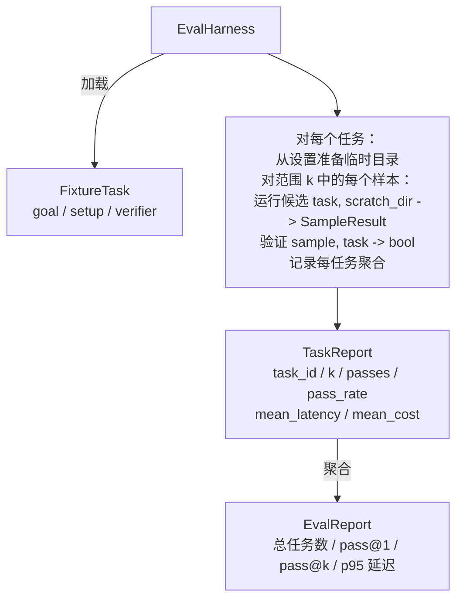

# 压轴项目第 27 课：带夹具任务的评估测试框架（Capstone Lesson 27: Eval Harness with Fixture Tasks）

> 编程智能体的好坏取决于你衡量它的任务套件。本课构建一个评估测试框架，接受一个夹具任务文件夹，通过候选智能体运行每个，通过确定性验证器对通过或失败进行评分，并将结果聚合为 pass@1、pass@k、平均延迟和平均成本。测试框架是让你区分回归和重构的事实来源。

**类型：** 构建  
**语言：** Python（标准库）  
**前置知识：** Phase 19 · 25（验证门控），Phase 19 · 26（沙箱运行器），Phase 14 · 30（评估驱动的智能体开发），Phase 14 · 19（SWE-bench 和 GAIA 基准）  
**预计时间：** 约 90 分钟

## 学习目标

- 将夹具任务定义为目标、设置和验证器的三元组。
- 对每个任务的多个样本运行评分，并计算 pass@1 和 pass@k。
- 将延迟和成本聚合为均值和第 95 百分位指标。
- 将确定性验证器（文件差异、退出代码、正则表达式匹配）连接到可重用函数。
- 发出回归追踪脚本可以摄入的结构化 JSON 报告。

## 问题

三种失败模式困扰着没有评估测试框架构建的智能体基准。

第一种是未验证的通过。智能体说它修复了 bug，人类瞥了一眼差异，套件被标记为绿色，三周后回归测试暴露了相同的 bug。智能体进行了合理的推理，但实际上没有修复任何东西。

第二种是未检测到的回归。对提示词模板的更改使智能体在响亮的任务上好了 4%，在安静的任务上差了 14%。没有黄金集和每任务分数，回归就会进入主分支，只有当客户抱怨时才会显现。

第三种是每任务漂移。评估在周一运行了 100 个任务，周五运行了其中 95 个，因为有人重命名了五个夹具。通过率看起来像是提升了 5%。其实不是。

测试框架是将这些失败变为事实的程序。它以可重现的顺序运行每个夹具，每次，对返回真或假的确定性检查的验证器进行评分。

## 核心概念

```mermaid
flowchart LR
  F1[fixtures/task_001/<br/>task.json + expected/] --> Harness
  F2[fixtures/task_002/<br/>...] --> Harness
  Harness[测试框架<br/>对每个任务：<br/>设置 / 运行智能体 k 个样本 /<br/>验证每个样本 /<br/>记录延迟，成本]
  Harness --> Report[EvalReport<br/>pass@1 / pass@k<br/>mean ms / p95 ms<br/>mean cost]
```

`FixtureTask` 是一个小型 JSON 文件加上可选的 `expected/` 目录。JSON 声明 `id`、`goal`（提供给智能体的提示词）、`setup` 块（放入临时目录的文件）和 `verifier` 块。验证器块在测试框架的验证器注册表中命名一个函数并提供其参数。

三种验证器形状涵盖了大多数有用的任务。

第一种是 `file_equals`。智能体运行后，将命名文件与预期内容进行比较。这捕获"以这种精确方式修复此 bug"的任务。

第二种是 `regex_match`。命名文件的内容与正则表达式匹配。这捕获"函数必须存在并返回 X"的任务，其中有许多可接受的解决方案。

第三种是 `shell_exit_zero`。测试框架运行 shell 命令（通过第 26 课的沙箱），只有当命令以零退出时任务才通过。这捕获"测试必须通过"的任务。

测试框架每个任务运行 k 次。Pass@k 是 `1 - (1 - p)^k`，其中 p 是实证通过率；测试框架还报告原始计数，以便你发现方差。延迟是每个样本的挂钟时间。成本是智能体自我报告的任何内容（token 数、美元或两者）；测试框架跨样本求和并显示每任务和聚合数字。

## 架构



候选是可调用的：`Callable[[FixtureTask, str], SampleResult]`。测试框架通过 `tempfile.mkdtemp()` 创建临时目录，并将其路径作为普通字符串传递。测试框架不关心候选如何工作。候选可以是确定性补丁应用器（用于测试框架自测试）、真实 LLM 智能体或模糊器。契约是 SampleResult。

## 你将构建什么

`main.py` 提供：

1. `FixtureTask` 数据类。
2. `SampleResult` 数据类：success_self_reported、latency_ms、cost_units、edits。
3. `TaskReport`、`EvalReport` 数据类，带 `to_dict()`。
4. `VerifierRegistry` 将验证器名称映射到函数。内置验证器：file_equals、regex_match、shell_exit_zero。
5. `EvalHarness` 类。针对候选运行任务目录。返回 EvalReport。
6. 捆绑在 `tasks/` 中的五个夹具任务：
   - `fizzbuzz` 中的差一错误
   - `factorial` 中缺少返回值
   - 错误消息中的拼写错误
   - 空函数体
   - 链表遍历中的差一错误
7. 确定性参考候选（`apply_known_fixes`），测试框架用它来演示 pass@1 为 1.0 的干净结果。
8. 演示打印 EvalReport JSON 并以零退出。

夹具任务捆绑为 `tasks/` 中的 JSON 文件，加上 `tasks/<id>/buggy/` 和 `tasks/<id>/expected/` 中的配对源文件。测试框架将 buggy 复制到临时目录，交给候选，并与 expected 进行验证。

## 为什么要 pass@k 而不只是 pass@1

真实的 LLM 智能体是随机的。pass@1 为 0.6 看起来像是失败。pass@5 为 0.95 表明智能体大多数时候都能得到正确答案，但在早期样本上选择错误。修复方法是采样和排名，而不总是更多训练。Pass@k 使这一点可见。

Pass@k 与 pass@1 一起报告，因为 pass@k 掩盖了真正的失败：如果模型在 20 次尝试中有一次得到了正确答案，你没有一个有用的智能体。测试框架显示两者。

## 这与 Track A 的其余部分如何组合

第 25 课产生了门控链。第 26 课产生了沙箱。测试框架对任何 `shell_exit_zero` 验证器使用沙箱。第 28 课将每次测试框架运行包装在 OTel 追踪中。第 29 课针对其中一个捆绑的夹具运行端到端演示，并断言参考候选的 pass@1 = 1.0。

## 运行它

```bash
cd phases/19-capstone-projects/27-eval-harness-fixture-tasks
python3 code/main.py
python3 -m pytest code/tests/ -v
```

演示以 JSON 格式打印 EvalReport，包括 pass@1、pass@5、平均延迟和每任务细分。退出代码为零。测试涵盖验证器函数、pass@k 数学、夹具加载，以及测试框架针对捆绑的参考候选的端到端。
