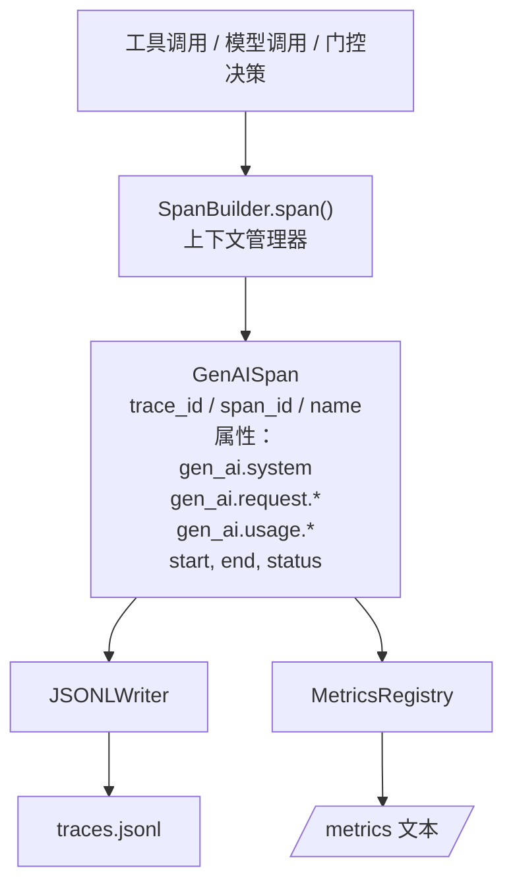
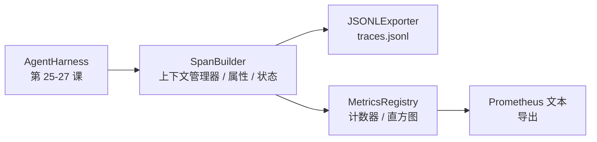

# 压轴项目第 28 课：使用 OTel GenAI Span 和 Prometheus 指标的可观测性（Capstone Lesson 28: Observability with OTel GenAI Spans and Prometheus Metrics）

> 没有可观测性的智能体测试框架是一个花钱的黑匣子。本课手工构建一个 span 构建器，发出符合 OpenTelemetry GenAI 语义约定的记录，每行一个 span 写入 JSON-Lines 文件，并以 Prometheus 文本格式暴露计数器和直方图。整个实现是标准库 Python，可以离线运行。

**类型：** 构建  
**语言：** Python（标准库）  
**前置知识：** Phase 19 · 25（验证门控），Phase 19 · 26（沙箱），Phase 19 · 27（评估测试框架），Phase 13 · 20（OpenTelemetry GenAI），Phase 14 · 23（OTel GenAI 约定）  
**预计时间：** 约 90 分钟

## 学习目标

- 构建符合 OpenTelemetry GenAI 语义约定形状的 span 数据类。
- 实现每行写入一个自包含 span 的 JSONL 导出器。
- 构建带标签的计数器和直方图，以及 Prometheus 文本格式的导出。
- 将任何可调用包装在记录持续时间、状态和异常的 span 上下文管理器中。
- 验证发出的 span 通过 `json.loads` 往返并匹配规范形状。

## 问题

生产中的编程智能体每轮产生三类工件：模型调用、工具执行和验证门控决策。没有结构化遥测，这些都没有用处。

第一种失败模式是缺少追踪。周二出了问题，但唯一的记录是一个 500 行的聊天日志。没有记录哪个工具运行、花了多长时间、有多少 token 进入提示词，或者门控是否拒绝了任何东西。智能体作者只能猜测。

第二种失败模式是无法解析的追踪。测试框架写了 span，但使用了自己的临时字段名。Grafana、Honeycomb、Jaeger 或本地 CLI 中没有任何东西可以读取它们。团队栈中存在的任何工具都被浪费了，因为 span 不是标准的。

第三种失败模式是未聚合的指标。你可以在追踪中看到一个缓慢的工具调用，但你无法回答"过去一小时 read_file 调用的 p95 延迟是多少？"，因为没有指标，只有追踪。

OpenTelemetry GenAI 语义约定正是为此而存在的。它们定义了 LLM 框架之间的 span 发出者共享的一小组标准属性。如果你的测试框架写入这些属性，每个 OTel 兼容的后端都可以读取它们。

## 核心概念



测试框架中的每个操作都产生一个 span。span 有追踪 id（整个智能体调用）、span id（此操作）、名称（如 `gen_ai.chat`、`gen_ai.tool.execution`）、遵循 GenAI 约定的属性、开始和结束时间，以及状态。

GenAI 约定标准化了这些属性键：`gen_ai.system`（哪个供应商，如 `anthropic`、`openai`）、`gen_ai.request.model`（模型 id）、`gen_ai.request.max_tokens`、`gen_ai.usage.input_tokens`、`gen_ai.usage.output_tokens`、`gen_ai.response.model`、`gen_ai.response.id`、`gen_ai.operation.name`，加上工具特定键 `gen_ai.tool.name` 和 `gen_ai.tool.call.id`。

导出器写入 JSONL。每行一个 JSON 对象。这是下游工具可以流式传输、grep 和导入的最简单格式。真正的 OTel 导出器会说 OTLP gRPC；课程的 JSONL 导出器是离线等效物，在每个工作站上以零退出。

指标与追踪并排。计数器在每次工具调用时递增：`tools_called_total{tool="read_file"}`。直方图记录观察到的延迟：`tool_latency_ms{tool="read_file"}`。两者都序列化为 Prometheus 文本导出格式，这是基于拉取的指标的事实标准。

## 架构



span 构建器是一个带 `span(name, attrs)` 方法的小类，返回上下文管理器。上下文管理器在进入时记录开始时间，在退出时记录结束时间，如果引发异常则附加异常，并将最终的 span 推送到导出器。

指标注册表是两个字典。计数器是 `{(name, frozen_labels): int}`。直方图将原始样本保存在列表中，并在导出时序列化为 Prometheus 直方图桶。

## 你将构建什么

`main.py` 提供：

1. `GenAISpan` 数据类：trace_id、span_id、parent_span_id、name、attributes、start_unix_nano、end_unix_nano、status、status_message、events。
2. `SpanBuilder` 类，带 `span(name, attrs, parent=None)` 上下文管理器。
3. `JSONLExporter` 类，带附加一行的 `export(span)`。
4. `Counter` 和 `Histogram` 类加 `MetricsRegistry`。
5. `prometheus_exposition(registry)` 产生文本格式输出。
6. `wrap_tool_call(name)` 装饰器，发出 span 并更新指标。
7. 演示：合成完整的智能体调用（围绕工具 span 的 gen_ai.chat span），写入 traces.jsonl，打印 Prometheus 导出，以零退出。

span id 和 trace id 是 16 字节十六进制字符串，从 `os.urandom` 生成。这与 OTel 的 W3C 追踪上下文匹配。导出器从不抛出；IO 错误会暴露，但测试框架继续运行。

直方图有固定的桶集（OTel 延迟（毫秒）的默认值：5、10、25、50、100、250、500、1000、2500、5000、10000、+Inf）。样本存储为列表；导出按需计算每桶计数。

## 为什么手工构建而非 opentelemetry-sdk

OTel Python SDK 是真实依赖。它也是几千行代码、OTLP 导出器的多个进程，以及压倒课程预算的运行时成本。手工构建版本教会了线格式。在生产中，你将相同的属性连接到真正的 SDK，并免费获得 OTLP 导出器、批处理和资源检测。

约定是稳定的。课程发出的线格式将在 2030 年继续解析，因为 OTel 从不破坏 GenAI 属性名称；他们只添加新的。

## 这与 Track A 的其余部分如何组合

第 25 课产生了门控链。第 26 课产生了沙箱。第 27 课产生了评估测试框架。第 28 课使所有三者可观测。第 29 课将端到端演示的每一步包装在 span 中，并在末尾打印 Prometheus 文本。

## 运行它

```bash
cd phases/19-capstone-projects/28-observability-otel-traces
python3 code/main.py
python3 -m pytest code/tests/ -v
```

演示在课程的工作目录中发出 `traces.jsonl`（最后清理），然后打印三个 span 的样本，然后打印计数器和直方图的 Prometheus 导出。测试验证 span 序列化往返，规范 GenAI 属性存在，计数器正确递增，以及直方图导出包含预期的桶计数。
