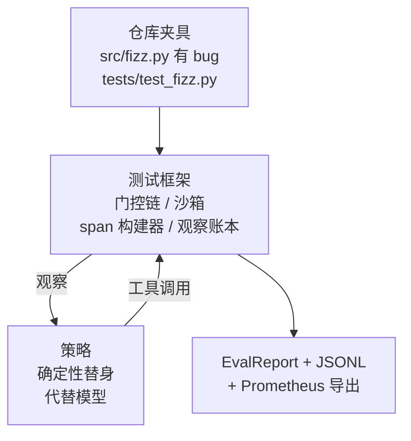
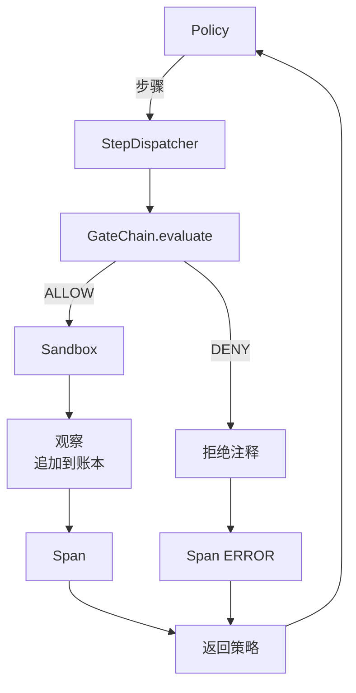

# 压轴项目第 29 课：测试框架上的端到端编程智能体（Capstone Lesson 29: End-to-End Coding Agent on the Harness）

> Track A 的回报。本课将门控链、沙箱、评估测试框架和 OTel span 缝合成一个工作中的编程智能体，修复多文件 Python 项目中的真实（小型、夹具规模）bug。智能体是确定性策略，而非 LLM；这种替换使课程可重现，并表明测试框架才是一直以来有趣的部分。契约是相同的：真实模型在策略接缝处插入。

**类型：** 构建  
**语言：** Python（标准库）  
**前置知识：** Phase 19 · 25（验证门控），Phase 19 · 26（沙箱），Phase 19 · 27（评估测试框架），Phase 19 · 28（可观测性），Phase 14 · 38（验证门控），Phase 14 · 41（真实仓库工作台），Phase 14 · 42（智能体工作台压轴项目）  
**预计时间：** 约 90 分钟

## 学习目标

- 将门控链、沙箱、评估测试框架和 span 构建器组合成单一智能体循环。
- 实现使用 read_file、run_tests 和 write_file 修复夹具 bug 的确定性策略。
- 跨端到端运行强制执行全局步骤预算加观察 token 预算。
- 为完整运行发出完整的 OTel GenAI 追踪和 Prometheus 指标。
- 验证智能体在少于 12 步内解决夹具，合法工具上零门控触发。

## 问题

大多数智能体演示在隔离中工作：沙箱单独，评估测试框架单独，span 发出器单独。它们看起来很好。将它们组合起来，接缝就显现了。

门控链说 ALLOW，但沙箱以链没有预见的原因拒绝。评估测试框架记录通过，但 OTel span 说门控拒绝了智能体声称使用的工具。当 Prometheus 计数器应该只递增一次时递增了两次。观察预算被超过但智能体继续，因为预算在链中被追踪而沙箱不知道。

本课是整个 Track 的集成测试。智能体必须按顺序做四件事：读取项目，运行测试，从测试失败中识别 bug，写入修复，重新运行测试，然后停止。每个操作都通过门控链。每个工具执行都通过沙箱。每个步骤都包装在 span 中。评估测试框架在最后对整体进行评分。

## 核心概念



智能体的策略是一个状态机。五个状态。

`SURVEY`：智能体读取项目列表。下一个状态是 RUN_TESTS。

`RUN_TESTS`：智能体运行测试命令。如果测试通过，状态机以成功停止。否则下一个状态是 INSPECT。

`INSPECT`：智能体读取失败的源文件。下一个状态是 FIX。

`FIX`：智能体写入修正的文件。下一个状态是 VERIFY。

`VERIFY`：智能体再次运行测试命令。如果测试通过，停止成功。否则停止失败。

每个状态对应一个工具调用。每个工具调用通过门控链。如果工具调用被拒绝，智能体在追踪中报告拒绝并停止。

夹具 bug 是 `fizz.py` 中的差一错误。确定性策略通过正则表达式从测试失败消息中检测 bug 并发出修正的文件。将策略替换为 LLM 不会改变测试框架契约。

## 架构



课程是自包含的。每个前课原语都以最小规模在 `main.py` 中重新实现（门控、沙箱、账本、span），使课程无需导入兄弟课程即可运行。名称与第 25-28 课完全匹配，使概念映射明确。

## 你将构建什么

`main.py` 提供：

1. 最小测试框架原语，与第 25-28 课同名复制：`GateChain`、`Sandbox`、`ObservationLedger`、`SpanBuilder`、`MetricsRegistry`。
2. `CodingAgentPolicy` 类：带五个状态的状态机。
3. `Repo` 助手：用捆绑的有 bug 的夹具准备临时目录。
4. `AgentRun` 类：驱动策略，通过测试框架分发，返回 `AgentRunReport`。
5. 捆绑的夹具（`fixture_repo/`），带 src/fizz.py、tests/test_fizz.py 和用于评估测试框架的 expected/ 树。
6. 演示：端到端运行策略，打印逐步追踪，断言通过，打印指标。

捆绑的夹具与第 27 课任务结构形状相同：一个有 bug 的文件和一个测试文件。测试失败消息包含足够的信息，使确定性策略能够识别修复。真实 LLM 会做同样的工作，更慢且具有更广的召回，但不会改变测试框架的期望。

## 为什么策略不是 LLM

真实 LLM 需要 API 密钥、网络调用和无法验证的随机性。测试框架是课程关心的部分。替换为确定性策略使课程能在任何开发者笔记本上运行，没有外部依赖，并让测试套件断言精确的步骤数。

课程的策略是 LLM 智能体所做工作的严格子集。策略读取仓库，看到失败的测试，识别那一行，并发出修复。LLM 经历相同的循环，使用相同的测试框架契约；簿记是相同的。

## 演示断言什么

端到端演示在退出时断言五件事，测试套件以编程方式重新断言它们。

策略在少于 12 步内解决了夹具。

观察预算从未被超过。

合法工具上零门控拒绝触发。（智能体从未发明被拒绝的工具名称。）

每个步骤在 traces.jsonl 中都有对应的 span。

Prometheus 导出包含 `tools_called_total{tool="read_file"}` 条目和 `tool_latency_ms` 直方图。

## 这与 Track A 的其余部分如何组合

本课是集成。第 25 课写了门控链。第 26 课写了沙箱。第 27 课写了评估测试框架。第 28 课写了可观测性。第 29 课证明它们作为一个系统工作。真实的智能体测试框架从这里扩展：将确定性策略换为模型，将捆绑的夹具换为真实仓库任务，将 JSONL 导出器换为 OTLP。

## 运行它

```bash
cd phases/19-capstone-projects/29-end-to-end-coding-task-demo
python3 code/main.py
python3 -m pytest code/tests/ -v
```

演示打印逐步追踪、最终评估报告和 Prometheus 导出。退出代码为零。测试涵盖策略状态转换、合成工具调用上的门控拒绝、捆绑夹具上的端到端运行，以及步骤预算不变量。
