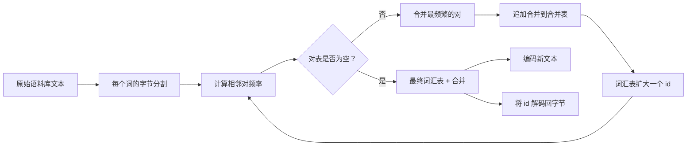
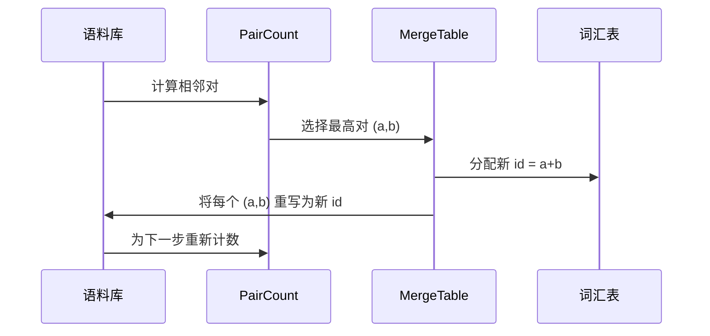

# 从头开始构建 BPE 分词器（BPE Tokenizer From Scratch）

> 字节输入，id 输出，id 再还原为相同字节。构建每个现代文本模型仍然从中开始的分词器。

**类型：** 构建  
**语言：** Python  
**前置知识：** Phase 04 课程，Phase 07 Transformer 课程  
**预计时间：** 约 90 分钟

## 学习目标
- 通过反复合并最频繁的相邻符号对，从原始文本语料库训练字节对编码词汇表。
- 实现确定性合并表并将其应用于新文本以产生子词 id 流。
- 将任意 UTF-8 输入往返到 id 再还原，不损失信息。
- 保留并保护特殊 token（`<|endoftext|>`、`<|pad|>`），使其在训练和解码过程中保持完整。
- 理解为什么字节级字母表是通用分词器的正确底层。

## 框架

语言模型从不看文本。它看整数。从字符串到整数列表再返回的映射就是分词器。错误处理这一层，训练过程中的每个损失曲线都在测量错误的东西。

通用文本模型最主要的子词分词器家族是字节对编码。思想很简单。从已知字母表开始。找到训练语料库中出现最频繁的相邻符号对。将其合并为新符号。重复直到词汇表达到目标大小。对新文本进行编码以相同顺序复用相同的合并列表。

我们将构建字节级变体。字母表是 256 个原始字节，而非 Unicode 码点。这个选择使分词器可以处理任何 UTF-8 输入而无需回退到未知 token。

## 管道

训练侧和推断侧共享合并表。这种共享就是契约。如果你在推断时改变合并顺序，你会解码不同的 id 流。

## 字节字母表

前 256 个 id 为原始字节 0x00 到 0xFF 保留。这保证了每个输入字符串在任何合并发生之前都可以在词汇表中表达。在字节块之后，我们为特殊 token 保留一小段范围。训练循环从不将这些 id 作为合并目标，因为我们将它们完全排除在预分词流之外。

预分词器在训练看到语料库之前在空白字符和标点边界上分割。没有这个分割，BPE 合并步骤会欣然学习跨词边界的合并，词汇表会充满整个常见短语。有了分割，合并保持在词内，结果具有泛化性。

## 训练循环

对于每个训练步骤，循环做三件事。它遍历语料库中的每个词，计算当前符号的每个相邻对出现的频率，按词本身出现的频率加权。它选择计数最高的对。它将该对的每次出现重写为词汇表中下一个空闲槽的新符号的单个新符号。然后记录合并。

每步的成本与语料库大小（以符号序列列表表示）成线性关系。对于一百万个词和一万个 id 的目标词汇表，循环在几秒内运行完成，因为符号序列随着合并落地而缩短。

## 编码新文本

推断不调用合并计数器。它以学习的相同顺序应用合并表。对于新词，编码器从字节分割开始。它扫描当前序列以找到排名最低的合并（最早适用的合并）。它执行那次合并。再次扫描。当表中没有合并适用于当前序列时，循环结束。

按排名排序是使编码确定性并在相同输入上匹配训练行为的属性。最先学习的合并位于表的顶部，最先应用。如果两个合并可以在同一位置应用，排名较低的获胜。

## 特殊 token

特殊 token 是字节流永远无法产生的 id。我们手动保留它们。这节课两个就足够了。

- `<|endoftext|>` 在预训练期间分隔文档。它告诉模型"新文档从这里开始，不要让前一个文档的上下文泄漏进来"。
- `<|pad|>` 填充短序列，使批次可以是矩形张量。损失掩码在训练期间隐藏它。

编码器接受一个标志以允许输入中的特殊 token。标志关闭时，字符串 `<|endoftext|>` 和 `<|pad|>` 被编码为拼写它们的字节。标志开启时，字面字符串被映射到它们的保留 id，不受任何合并影响。

## 往返保证

编码然后解码必须精确返回输入字节。解码器按顺序连接每个 id 的字节展开。由于每个 id 要么是原始字节，要么是两个先前已知 id 的连接，递归展开总是在原始字节处终止。然后解码返回这些字节拼写的 UTF-8 字符串。

本课的测试套件在未见过的句子、包含 Unicode 表情的句子和包含字面 `<|endoftext|>` token 的句子上检查该属性。

## 本课不做什么

它不构建生产分词器风格的正则表达式驱动预分词器。这里的预分词器是小型的空白字符和标点分割。它足以在小型训练语料库上产生合理的合并，与课程链的其余部分的契约保持不变。下一课将分词器视为黑盒，并在其上构建滑动窗口数据集。

它不并行化对计数器。Python 循环在几千个词的语料库上在不到一秒内完成。对于更大的语料库，明显的做法是并行计算每个词的对并归约。

## 如何阅读代码

`main.py` 定义了四个对象。`BPETokenizer` 保存词汇表、合并表和特殊 token 表。`train` 是训练循环。`encode` 是推断路径。`decode` 是字节连接。底部的演示在内置语料库上训练一个小型分词器，编码一个保留句子，解码 id 回来，并打印两者。`code/tests/test_bpe.py` 中的测试固定了往返属性、特殊 token 保留和合并排序。

运行演示。然后将演示中的目标词汇表大小从 300 改为 600，观察保留句子的编码长度如何下降。该曲线就是 BPE 压缩曲线。
