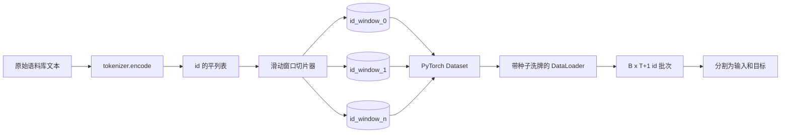
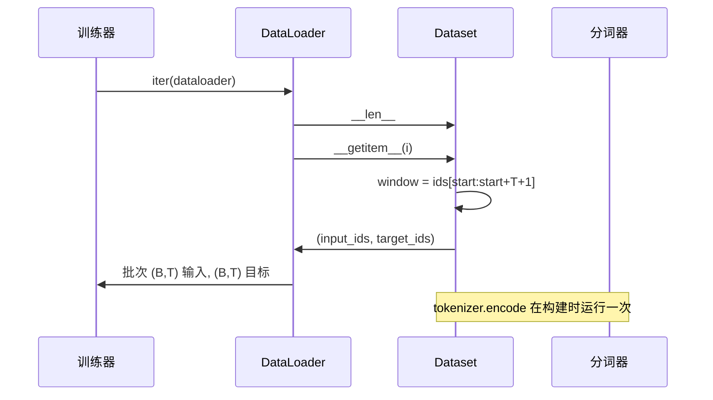

# 带滑动窗口的分词数据集（Tokenized Dataset with Sliding Window）

> 预训练运行是从 token id 到梯度的函数。本课构建向其输送 id 的传送带。

**类型：** 构建  
**语言：** Python  
**前置知识：** Phase 04 课程，Phase 07 Transformer 课程，本阶段第 30 课  
**预计时间：** 约 90 分钟

## 学习目标
- 通过一次调用分词器将原始语料库转换为 token id 流。
- 用可配置的重叠步幅将 id 流切片为固定长度窗口。
- 构建一个 PyTorch Dataset，返回用于下一个 token 预测的输入和目标张量。
- 将数据集包装在每个 epoch 以确定性种子洗牌的 DataLoader 中。
- 推理步幅、冗余和有效数据集大小之间的权衡。

## 框架

预训练运行一次读取一批 token id 并更新模型。每批的形状由训练契约固定。对于因果语言模型，批次包含 `(B, T)` 输入 id 和 `(B, T)` 目标 id，其中目标是输入左移一位。数据管道的工作是以确定性和可重现的方式按需从可能是几 GB 原始文本的语料库中生成该契约。

本课构建管道。上一课的分词器将文本转换为长平 id 列表。滑动窗口将该列表切片为训练样例。自定义 Dataset 将样例暴露为张量。DataLoader 批处理它们，并用已知种子洗牌。

## 形状契约

因果 LM 消费形状为 `(B, T)` 的 id，其中 `B` 是批次大小，`T` 是上下文长度。位置 `t` 的目标是位置 `t+1` 的输入。这意味着每个训练样例覆盖 `T+1` 个原始 id。窗口步幅控制连续样例之间存在多少重叠。

切片器从不与语料库边界重叠。如果最后一个窗口没有足够的 id 填满 `T+1` 个位置，切片器会丢弃它。用 `<|pad|>` 填充尾部也是有效选择，但它使损失掩码复杂化。本课我们选择丢弃。

## 为什么使用滑动窗口

预训练语料库是一个长 id 流。如果模型只看非重叠窗口，每个训练样例会教它相同的 `T` 边界。调整步幅会移动这些边界，使模型看到更多样化的预测下一个 token 任务。

步幅为 `T` 产生非重叠窗口。步幅为 `T // 2` 产生 50% 重叠并将有效数据集翻倍。步幅为 `1` 产生最大重叠并将数据集增加 `T` 倍。代价是每个 epoch 更多计算。好处是更多边界多样性。大多数预训练运行使用等于上下文长度的步幅，因为语料库已经远大于模型在一个 epoch 中能完成的，所以边界多样性论点更弱。

## Dataset 类

PyTorch Dataset 有两个必需方法。`__len__` 返回样例数。`__getitem__` 将一个样例作为张量对返回。我们的 Dataset 存储编码的 id 流和步幅。对其进行索引会即时计算窗口的开始，所以内存成本是一份 id 流的副本，无论步幅产生多少样例。

移一位发生在 `__getitem__` 内部。Dataset 返回 `(input, target)`，其中 `input = window[:-1]`，`target = window[1:]`。两者都是 PyTorch long 张量。训练循环将它们视为基准真相。

## 确定性洗牌

带 `shuffle=True` 的 DataLoader 从 PyTorch 随机生成器读取。通过传递每个 epoch 按种子设定的显式 `torch.Generator`，我们每次重启运行时都获得相同的洗牌。当你想比较仅在单个超参数上不同的两次运行时，这个属性很重要。没有种子，两次运行以不同顺序看数据，损失曲线因与更改无关的原因而发散。

本课的种子契约很简单。`epoch_seed = base_seed + epoch_index`。基础种子在构造时传递。epoch 索引由训练器在每个 epoch 顶部递增。使用相同基础种子的重新运行在每个 epoch 中始终以相同顺序看数据。

## 批次采样器

PyTorch 中的默认采样器在禁用替换的情况下均匀随机选取索引。这就是我们预训练所需要的。对于小数据集的微调，契约是相同的。DataLoader 通过调用 `__getitem__` `B` 次并堆叠结果来组装批次。由于每个样例构造上是相同长度的，不需要填充逻辑。

课程为简单起见保持 `num_workers=0`。在生产运行中，工作者并行化 `__getitem__` 调用。使用我们的管道，这大多是无操作，因为工作只是内存中张量的切片，但相同的 Dataset API 干净地支持工作者。

## 计算样例数

对于长度为 `N` 的 id 流、上下文长度 `T` 和步幅 `S`，样例数为 `max(0, 1 + (N - (T + 1)) // S)`。课程将该计算暴露为 Dataset 上的静态方法，使训练器可以在不迭代的情况下计算每个 epoch 的总步数。

## 本课不做什么

它不从磁盘流式传输。语料库完全在内存中编码，并作为单个张量保存。对于几百万个 id 的语料库，这远低于一百 MB，是课程的正确形状。磁盘流式传输是一个单独的关注点，通过替换存储但保持 Dataset 契约来插入。

它不处理多个文档。语料库被视为一个连续的 id 流。在从多个文档构建语料库时，通过插入 `<|endoftext|>` id 来编码下一个文档边界。模型学习在边界附近进行预测。

## 如何阅读代码

`main.py` 定义两个类和一个助手。`SlidingWindowDataset` 是 PyTorch Dataset。`make_dataloader` 返回带种子生成器的配置 DataLoader。`_encode_corpus_to_ids` 是一次性分词器调用。底部的演示在进程中构建一个小型分词器，编码内置语料库，构造数据集和数据加载器，打印一批，并断言形状契约。`code/tests/test_dataset.py` 中的测试固定了窗口计数公式、移一位属性、确定性洗牌和步幅权衡。

运行演示。然后将上下文长度从 16 改为 32，观察每个 epoch 的样例数如何下降。那个数字就是你的每 epoch 步数预算。
