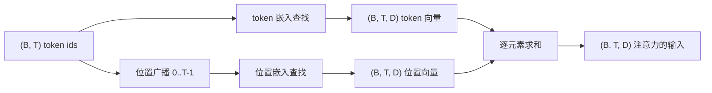
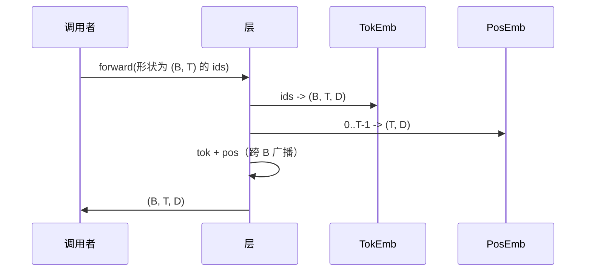

# Token 和位置嵌入（Token and Positional Embeddings）

> Id 是整数。模型需要向量。两个查找表位于它们之间，位置查找表的选择决定了模型可以学习什么。

**类型：** 构建  
**语言：** Python  
**前置知识：** Phase 04 课程，Phase 07 Transformer 课程，本阶段第 30 和 31 课  
**预计时间：** 约 90 分钟

## 学习目标
- 构建将词汇表 id 映射到密集向量的 token 嵌入查找表。
- 构建按位置索引的学习位置嵌入查找表。
- 构建无参数、按位置索引的固定正弦位置嵌入。
- 将 token 和位置嵌入组合成 Transformer 块的单个输入。
- 对比学习嵌入和正弦嵌入在长度泛化和参数数量方面的差异。

## 框架

模型与 token id 的第一次接触是 token 嵌入矩阵中的行查找。矩阵每个词汇表 id 有一行，每个模型维度有一列。查找返回一个向量，模型的其余部分将其视为 id 的含义。反向传播只更新在前向传递中使用的行。在训练过程中，这些行的几何形状学会在方向上编码相似性。

单独的 token id 没有顺序。模型需要第二个信号来告诉它位置 1 与位置 17 不同。该信号的两种主流选择是学习位置嵌入（第二个查找表，每个位置一行）和固定正弦位置嵌入（无参数的数学公式）。选择有后果。学习的表是参数，受模型训练的最大上下文长度限制。正弦表在理论上是无参数的，公式可以扩展到任何位置，但本课的 `SinusoidalPositionalEmbedding` 在 `max_context_length` 处预计算固定表，其 `forward` 在超过该界限时引发；因此两个模块都在这里强制最大上下文长度。即使表足够大，模型在训练长度之后仍可能遇到困难。

本课构建两者，并将它们与 token 嵌入组合成下一课注意力块的单个输入。

## 形状契约

嵌入阶段的输入是形状为 `(B, T)` 的 token id 批次。输出是形状为 `(B, T, D)` 的张量，其中 `D` 是模型维度。每个批次元素具有相同的上下文长度 `T`。每个位置具有相同的向量维度 `D`。



组合是求和，而非连接。求和在网络中保持 `D` 不变，让模型在每一层的每个特征基础上决定 token 含义还是位置主导。

## Token 嵌入矩阵

Token 嵌入是形状为 `(V, D)` 的参数张量，其中 `V` 是词汇表大小。PyTorch 将其暴露为 `nn.Embedding(V, D)`。初始化时，条目从小高斯分布中抽取，传统上对于 Transformer 规模模型均值为零，标准差约为 `0.02`。精确的初始化比在不同运行中保持一致不那么重要。

前向传递是单个索引操作。PyTorch 通过收集行将 `(B, T)` int64 id 映射到 `(B, T, D)` 浮点数。反向传递只在前向传递中触及的行中积累梯度。批次中从未出现的两行在该步骤接收零梯度。

一个细节。Token 嵌入和模型末端的输出投影通常共享权重（权重绑定）。当这种情况发生时，每次反向传递通过输出侧触及嵌入的每一行。这里的课程将两者作为单独模块暴露，但同一矩阵在完整模型中可以同时扮演两个角色。

## 学习位置嵌入

学习位置嵌入是形状为 `(max_context_length, D)` 的第二个 `nn.Embedding`。查找由位置 id `0, 1, 2, ..., T-1` 键控。前向传递在批次维度上广播该位置向量。

学习表的缺点是，如果模型只训练到位置 `T-1`，则无法在位置 `T` 处查询。该行不存在。使用这种方案的生产解码器模型将最大上下文长度烘焙到架构中，拒绝处理更长的输入。

## 正弦位置嵌入

正弦位置嵌入是从位置到向量的函数。位置 `p` 和特征 `i` 产生

```python
angle = p / (10000 ** (2 * (i // 2) / D))
emb[p, 2k]     = sin(angle)
emb[p, 2k + 1] = cos(angle)
```

该函数无参数。每个位置都有唯一向量。波长在特征维度上几何变化，所以较低维度编码粗略位置，较高维度编码精细位置。

共同使用 `sin` 和 `cos` 的选择产生的属性是，位置 `p + k` 的向量是位置 `p` 的向量的线性函数。这为注意力层提供了学习相对位置偏移的简单路径。模型不需要单独的参数来表达"向后看五个 token"。

课程在构造时一次性计算完整的正弦表，并在前向时对其进行索引。

## 组合

输入管道按顺序做三件事。读取 token id。查找 token 向量。添加位置向量。返回总和。



求和步骤中的广播在批次维度上复制 `(T, D)` 位置张量。PyTorch 自动处理这个问题，因为位置张量在 unsqueeze 后具有形状 `(1, T, D)`。

## 对比分析

课程在相同输入上运行两种变体并打印两个诊断。

第一个是参数计数。学习变体在 token 嵌入之上添加 `max_context_length * D` 参数。正弦变体添加零。

第二个是相邻位置嵌入之间的余弦相似度。正弦变体有平滑可预测的衰减，因为函数是连续的。学习变体在初始化时近乎随机相似，因为行是独立抽取的。训练后，学习变体通常会发展出类似的平滑结构，但它必须从数据中发现这种结构。

## 本课不做什么

它不构建旋转位置编码（RoPE）或 AliBi。这些是生产 Transformer 中的现代选择。它们都遵循与此处嵌入相同的形状契约（对形状为 `(B, T, D)` 的向量应用位置相关转换），但它们在注意力投影步骤而非输入处应用。下一课构建注意力块，可选扩展之一是将旋转折叠到那里的查询-键投影中。

它不训练嵌入。训练需要损失，需要模型输出，需要注意力和 LM 头。这是下一课和之后的课。

## 如何阅读代码

`main.py` 定义三个模块。`TokenEmbedding` 包装 `nn.Embedding(V, D)`。`LearnedPositionalEmbedding` 包装 `nn.Embedding(L, D)`。`SinusoidalPositionalEmbedding` 预计算表并将其暴露为缓冲区。`EmbeddingComposer` 将 token 嵌入和位置嵌入绑定在一起。底部的演示打印形状、参数计数和相邻位置相似度诊断。`code/tests/test_embeddings.py` 中的测试固定了形状、广播行为、参数计数和正弦公式。

运行演示。然后将模型维度 `D` 从 64 改为 32，观察正弦波长带如何变化。
