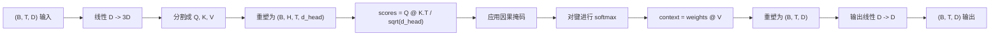
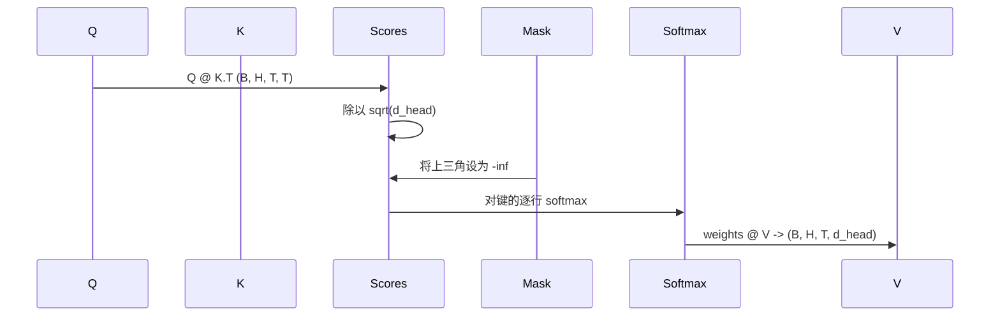

# 多头自注意力（Multi-Head Self-Attention）

> 一个线性投影，三个视图，H 个并行头，一个掩码。模型实际使用的注意力块。

**类型：** 构建  
**语言：** Python  
**前置知识：** Phase 04 课程，Phase 07 Transformer 课程，本阶段第 30-32 课  
**预计时间：** 约 90 分钟

## 学习目标
- 将批量查询/键/值投影实现为分成 H 个头的单个线性层。
- 用正确的归一化和数据类型处理计算缩放点积注意力。
- 应用防止位置关注未来位置的因果掩码。
- 检查固定输入的每头注意力权重，并推理每个头看什么。
- 在玩具任务上训练小型注意力块，观察损失随头特化而下降。

## 框架

注意力是让 token 表示从同一序列中的其他 token 提取信息的函数。自注意力意味着查询、键和值都来自相同输入。多头意味着投影被分成 H 个并行注意力问题，其输出被连接并投影回来。

高效实现模式是一个从 `D` 投影到 `3 * D` 的线性层，被切片成三个视图，然后重塑成 H 个各大小为 `D // H` 的头。矩阵乘法、softmax 和加权求和作为批量张量操作发生，所以头在加速器上并行运行。

本课构建那个块。它还添加了因果掩码，使相同代码可以作为解码器专用语言模型中的注意力层工作。下一课将块堆叠成完整 Transformer，之后的课对其进行训练。

## 形状契约

输入是 `(B, T, D)`。输出是 `(B, T, D)`。掩码是 `(T, T)` 或可广播到它。块内部的中间张量具有形状 `(B, H, T, d_head)`，其中 `d_head = D // H`。约束是 `D % H == 0`。

两个线性层（QKV 投影和输出投影）是块中唯一的参数。掩码、softmax、矩阵乘法和重塑都是无参数的。

## QKV 分割

朴素实现有三个单独的线性层，分别用于 Q、K 和 V。高效的实现有一个输出 `3 * D` 特征并分割结果的单个层。两者在数学上等价，因为三个独立的 `(D, D)` 权重矩阵乘法正好等于一个由它们堆叠的 `(3D, D)` 权重的矩阵乘法。

高效版本更快，因为加速器启动一个矩阵乘法而非三个。初始化也更容易，因为三个子矩阵在同一个参数张量中，可以一起初始化。

## 头重塑

分割后，Q、K、V 各为 `(B, T, D)`。要将其变成 H 个并行注意力问题，我们重塑为 `(B, T, H, d_head)` 并转置为 `(B, H, T, d_head)`。头维度现在与批次维度相邻，PyTorch 将每头注意力视为跨 `B * H` 个独立实例的批量操作。

d_head 维度保持在最后，使评分矩阵乘法 `Q @ K.transpose(-2, -1)` 收缩它。结果是 `(B, H, T, T)` 每头注意力分数。

## 缩放

分数在 softmax 之前除以 `sqrt(d_head)`。没有这个缩放，点积随着 `d_head` 增大而增大，将 softmax 推入一个条目有几乎全部质量而其他接近零的区域。那个区域的梯度很小，学习停滞。除以 `sqrt(d_head)` 在不同头大小下保持分数的方差大致恒定。

## 因果掩码

解码器专用语言模型在预测下一个 token 时只能以过去为条件。掩码强制执行这一点。具体来说，在 softmax 之前，`(T, T)` 分数矩阵对角线以上的每个条目被替换为负无穷。softmax 后这些位置得到零权重。

我们在构造时将掩码注册为缓冲区，使其与模型在同一设备上，并且不是梯度图的一部分。掩码覆盖块将看到的最大上下文长度。在前向时，我们切片左上角的 `(T, T)`。

## 输出投影

在每头上下文向量 `(B, H, T, d_head)` 之后，我们转置回 `(B, T, H, d_head)`，重塑为 `(B, T, D)`，并应用最终的 `(D, D)` 线性投影。输出投影让模型混合头。没有它，H 个头只能通过后续层重新组合，块会受到人为约束。

## 注意力权重检查

课程在前向传递中暴露 `return_weights=True` 标志。设置后，块除了输出之外还返回形状为 `(B, H, T, T)` 的每头注意力权重。演示在短输入上打印一个头的权重热图，这样你可以看到因果三角形结构和每位置焦点。

在训练好的模型中，不同的头学习不同的模式。有些头关注紧接的前一个 token。有些头关注序列的开始。有些头几乎均匀地分散注意力。检查钩子是可解释性工作的入口点。

## 训练演示

`main.py` 底部的演示将注意力块连接到小型 LM 头，并在重复任务上训练整体。输入的每一行是一个随机 id，在上下文中复制。目标是输入移一位，所以模型必须学习下一个 token 与前一个相同。损失是交叉熵。在 H=4、D=32、T=12 和 64 个词汇的情况下，损失在 CPU 上经过三个 epoch 从随机（约 `log(64) ~ 4.16`）降至远低于 `1.0`。

演示的目的不是训练有用的模型。目的是确认梯度流过块的每个部分，头在答案显而易见的问题上学到了些什么。

## 本课不做什么

它不添加前馈块。真实模型中的 Transformer 层是注意力后跟两层 MLP，每个周围都有残差连接和层归一化。下一课添加那些。

它不实现旋转或 AliBi 位置编码。两者都在同一块的 QKV 投影步骤处应用，但它们是单独的教学单元。这里构建的块通过在矩阵乘法之前转换 Q 和 K，与两者兼容。

它不实现用于推断的 KV 缓存。跨前向传递缓存键和值是使自回归解码快速的优化。它改变了 K 和 V 张量但不改变 Q 的形状契约。它属于推断课程。

## 如何阅读代码

`main.py` 定义 `MultiHeadSelfAttention`。该类包含两个线性层和一个注册的掩码缓冲区。前向传递投影、重塑、评分、掩码、softmax、加权、重塑并再次投影。底部的演示构建一个小型模型，将注意力与 token 和位置嵌入以及 LM 头包装，在复制任务上训练三个 epoch，并打印损失曲线和每头注意力热图。`code/tests/test_attention.py` 中的测试固定了形状契约、因果性属性、softmax 属性、头分割属性和梯度流。

运行演示。然后将 `n_heads` 从 4 增加到 8（保持 `d_model=32`，所以 `d_head=4`），观察热图如何变化。
