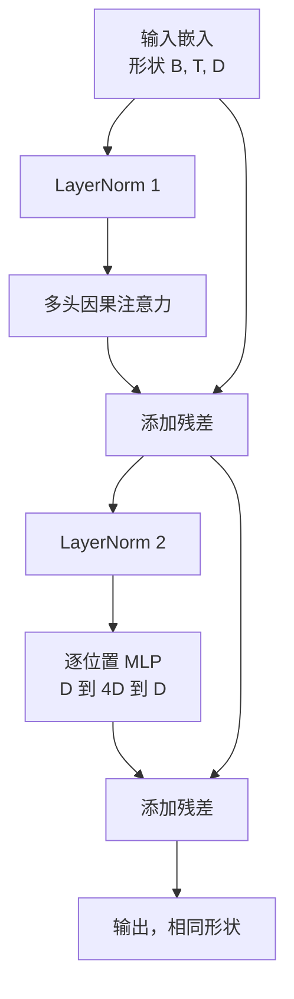

# 从头开始构建 Transformer 块（Transformer Block from Scratch）

> 一个块是每个现代解码器 LLM 的单元。层归一化、多头注意力、残差、MLP、残差。前置层归一化变体无需预热就能稳定训练。后置层归一化变体是原始论文发布的。本课并排构建两种，并展示哪种在常见学习率下能在 12 层堆叠中存活。

**类型：** 构建  
**语言：** Python  
**前置知识：** Phase 19 第 30-33 课（分词器、嵌入、注意力数学、批量数据加载器）  
**预计时间：** 约 90 分钟

## 学习目标

- 从四个移动部件构建 PyTorch Transformer 块：LayerNorm、多头因果注意力、残差连接、逐位置 MLP。
- 在两种配置中放置 LayerNorm（前置和后置），并解释为什么一种无需预热就能稳定训练。
- 在多头注意力中实现因果掩码，使 token `i` 无法看到 token `j > i`。
- 在 12 层堆叠上追踪两种变体的梯度流，并不含糊地读取结果。
- 将块作为下一课组装 1.24 亿参数 GPT 时的即插即用单元复用。

## 问题

Transformer 是一个反复的块。错误地构建一次块，重复 12 次，你会发布一个在第一个 epoch 发散或需要预热技巧一路走下去的模型。你在本课中看到的两种失败模式并不罕见。它们在学习者朴素地堆叠块时第一次就会出现。一个是注意力层关注未来。另一个是 LayerNorm 放在深层无法控制残差信号的地方。

一旦看到，修复就是机械的。块恰好有两条残差路径和两个归一化位置。正确选择位置，栈的其余部分只是簿记。

## 核心概念

每个解码器专用 Transformer 块是一个接受形状为 `(batch, sequence, embedding)` 的张量并返回相同形状张量的函数。内部，两个子层完成工作。



这是前置层归一化变体。LayerNorm 位于残差分支内，在子层之前。残差连接向前携带未归一化的信号。

后置层归一化变体将 LayerNorm 移到残差相加之后。

形状相同。训练行为不同。使用后置层归一化，通过残差路径反流的梯度必须经过 LayerNorm。在深度 12 和学习率 `3e-4` 时，该梯度缩小得足够快以至于需要预热计划。前置层归一化使残差路径保持未归一化，所以梯度干净地传播到嵌入层。因此，GPT-2 及以后都使用前置层归一化配置。

### 因果多头注意力

注意力子层以三种方式投影输入到查询、键、值张量。每个从 `(B, T, D)` 重塑为 `(B, H, T, D/H)`，其中 `H` 是头数。缩放点积注意力计算每头的 `softmax(Q K^T / sqrt(d_k))`，将上三角掩码为负无穷，通过 softmax 应用掩码，然后乘以 `V`。头被连接回单个 `(B, T, D)` 张量并再次投影。掩码是使模型因果的唯一部分。忘记掩码，你训练了一个作弊的模型。

### MLP

逐位置 MLP 对每个 token 独立应用相同的两层网络。隐藏宽度是嵌入宽度的四倍，激活是 GELU，第二个线性后跟 dropout。MLP 内部没有 token 相互交流。所有 token 混合发生在注意力中。

### 残差连接做两件事

它们使梯度路径在深度上是加性的，这在 12 层中保持梯度范数在规模内。它们还让每个块学习对运行表示的加性更新，而不是完全替换。这两个效果都是块能够扩展的原因。

## 构建它

`code/main.py` 实现：

- `class LayerNorm`：带可学习的缩放和移位，有偏差 eps，按每个 token 向量应用。
- `class MultiHeadAttention`：带 `num_heads`，`head_dim = d_model // num_heads`，融合 QKV 投影，注册的因果掩码，注意力和残差 dropout。
- `class FeedForward`：两个线性层，GELU 激活，dropout。
- `class TransformerBlock`：带 `pre_ln` 标志，在两种变体之间切换。
- 演示：构建 6 层前置层归一化堆叠和 6 层后置层归一化堆叠，使用相同输入，并打印（a）输出形状，（b）一次反向传递后嵌入处的梯度范数。

运行它：

```bash
python3 code/main.py
```

输出：两种堆叠的形状检查，梯度范数并排。前置层归一化堆叠的嵌入梯度在相同学习率下比后置层归一化堆叠大一个数量级，这是前置层归一化无需预热训练的实证信号。

## 技术栈

- `torch` 用于张量数学、自动微分和 `nn.Module` 管道。
- 没有 `transformers`，没有预训练权重。块从基元实现。

## 生产中的模式

三种模式将教科书块变成你可以发布的东西。

**融合 QKV 投影。** 三个单独的线性层需要三个内核启动和三个矩阵乘法。宽度为 `3 * d_model` 的一个线性层在一次启动中完成相同工作，然后沿最后一个轴分割输出。融合路径在每个加速器上都更快，与 GPT-2、LLaMA 和 Mistral 的参考实现所发布的相匹配。

**注册因果掩码缓冲区。** 掩码只取决于最大上下文长度。在构造时用 `register_buffer` 分配一次，每次前向传递按活跃窗口切片，跳过每次调用的分配。忘记这一点会在长上下文处将掩码变成分配器热点。

**Dropout 在两处，而非三处。** Dropout 属于注意力 softmax 之后（注意力 dropout）和 MLP 的第二个线性之后（残差 dropout）。残差本身上的 dropout 破坏了让梯度在深层流动的加性恒等式。一些早期实现做错了，为此付出了脆弱训练的代价。

## 使用它

- 本课中的块直接插入第 35 课的 GPT 组装中，无需修改。
- 前置层归一化变体是每个现代开放权重 LLM 使用的。后置层归一化变体是 2017 年原始注意力论文使用的。了解两者足以阅读你会遇到的任何解码器架构。
- 将 GELU 换为 SiLU，你就有了 LLaMA 家族激活。将 LayerNorm 换为 RMSNorm，你就有了 LLaMA 家族归一化。相同的骨架。

## 关键术语

| 术语 | 通俗说法 | 准确含义 |
|------|----------|----------|
| Pre-LN（前置层归一化） | "前置归一化" | LayerNorm 在残差分支内，每个子层之前；残差携带未归一化的信号 |
| Post-LN（后置层归一化） | "后置归一化" | 残差相加后的 LayerNorm；2017 年论文发布的，需要预热 |
| Causal mask（因果掩码） | "三角掩码" | 注意力 logit 的上三角设为负无穷，使 token i 无法读取 token j（当 j 大于 i 时） |
| Fused QKV（融合 QKV） | "组合投影" | 宽度 3D 的一个线性，而非宽度 D 的三个线性；一个内核，一个矩阵乘法 |
| Residual stream（残差流） | "跳跃连接" | 从顶到底流过每个块的未归一化张量；每个块添加到的东西 |

## 延伸阅读

- Phase 7 第 02 课（从头开始的自注意力）用于该块下面的注意力数学。
- Phase 7 第 05 课（完整 Transformer）用于同一骨架的编码器-解码器版本。
- Phase 10 第 04 课（预训练迷你 GPT）用于该块插入的训练程序。
- Phase 19 第 35 课（本 Track），将 12 个这样的块堆叠成 GPT 模型。
