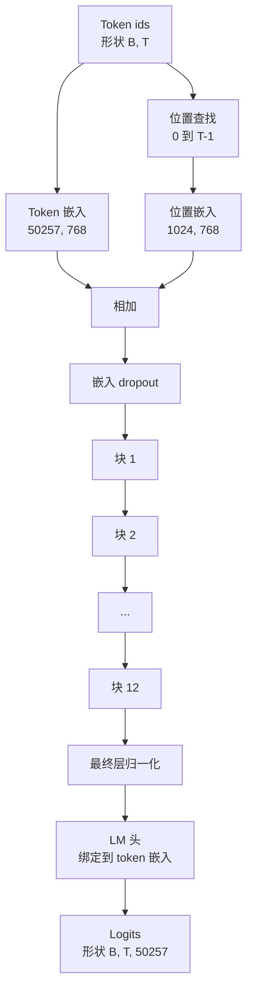

# GPT 模型组装（GPT Model Assembly）

> 堆叠 12 个块，一个 token 嵌入，一个学习位置嵌入，一个最终层归一化，以及一个绑定的语言模型头。这就是整个 1.24 亿参数的 GPT 模型。本课将这些部件组装成一个工作类，统计参数以确认模型匹配参考的 124M 形状，并使用多项式采样、温度和 top-k 生成文本。

**类型：** 构建  
**语言：** Python  
**前置知识：** Phase 19 第 30-34 课  
**预计时间：** 约 90 分钟

## 学习目标

- 将第 34 课的 Transformer 块组装成完整 GPT 模型：token 嵌入、位置嵌入、N 个块、最终层归一化、语言模型头。
- 复现 1.24 亿参数配置：词汇表 50257，上下文 1024，嵌入 768，12 个头，12 层。
- 将语言模型头权重绑定到 token 嵌入，并解释为什么在这个规模节省约 3800 万参数。
- 使用多项式采样、温度缩放和 top-k 截断从提示词生成文本，用滑动窗口保持上下文长度。
- 测量参数计数和前向传递成本，与 124M 目标对比。

## 问题

Transformer 块本身什么都做不了。你需要将 token id 转换为向量，混入位置信息，通过堆叠运行它们，然后投影回词汇表 logit。忘记这四个步骤中的任何一个，模型要么前向传递失败，要么位置信息漂移，要么无法生成文本。

模型的形状也很重要。参考 GPT-2 small 在上述精确配置下是 1.24 亿参数。这些数字不是魔法。词汇表 50257 乘以嵌入 768 是 token 表。位置 1024 乘以 768 是位置表。12 个块每个约 700 万参数是 8400 万。最终头通过权重绑定复用 token 表。将各部分求和，你得到 1.24 亿。构建参数计数不匹配参考的模型是你连接了错误的东西的信号。

## 核心概念



Token id 变成 token 向量。位置 id 变成位置向量。两者相加并通过堆叠发送。最终层归一化是每个现代变体中块之外唯一存活的部分。LM 头复用 token 嵌入矩阵，这就是权重绑定的含义。

### 权重绑定

Token 嵌入形状为 `(vocab, d_model)`。语言模型头需要从 `d_model` 投影回 `vocab`。这两者互为转置。绑定两者意味着字面上相同的参数张量，使用两次。在词汇表 50257 和 d_model 768 时，矩阵是 3800 万参数。未绑定，你为其付费两次。绑定，你付费一次，还获得稍微更干净的梯度信号，因为嵌入和头一起更新。

### 位置嵌入是学习的，而非正弦的

GPT-2 使用学习位置嵌入。位置表是一个形状为 `(1024, 768)` 的参数张量。模型在每次前向时查找位置 0 到 T-1，并将查找结果添加到 token 嵌入。这是位置方案（RoPE、ALiBi、T5 相对偏差是替代方案）中最简单的，也是 124M 参考所使用的。

### 生成：温度、top-k、多项式

生成是自回归的。在每个步骤，模型在每个位置返回完整词汇表上的 logit。你只取最后一个位置，除以温度，可选地将除前 k 个 logit 外的所有 logit 掩码为负无穷，softmax 得到概率，并从结果分布中采样一个 token。


三个旋钮，三种不同行为。温度接近零折叠为贪婪。温度为一匹配模型的自然分布。Top-k 为一是贪婪的。Top-k 为 40 过滤长尾。组合很重要；下一课的训练使用生成作为定性评估信号。

## 构建它

`code/main.py` 实现：

- `class GPTConfig` 数据类，带 124M 默认值：`vocab_size=50257`、`context_length=1024`、`d_model=768`、`num_heads=12`、`num_layers=12`、`mlp_expansion=4`、`dropout=0.1`、`use_bias=True`、`weight_tying=True`。
- `class GPTModel`，带 token 嵌入、位置嵌入、嵌入 dropout、12 个 `TransformerBlock`、最终层归一化，以及在标志设置时绑定到 token 嵌入的 `lm_head`。
- 返回唯一参数计数（因此权重绑定在计数中被遵守）的 `count_parameters` 助手。
- 执行温度、top-k、多项式和滑动窗口上下文的 `generate` 函数。
- 演示：构建模型，将参数计数与参考 124M 并排打印，并从固定提示词生成短序列以展示管道端到端。

运行它：

```bash
python3 code/main.py
```

输出：参数计数与 124M 参考并排，来自随机提示词的生成 token id，以及绑定开启时 LM 头和 token 嵌入共享存储的确认。

为了保持演示快速，脚本还端到端运行一个小型配置（`d_model=64`，`num_layers=2`）并内联打印生成的 token 序列。124M 配置被构建，但只测试了其参数计数和一次前向传递。

## 关键术语

| 术语 | 通俗说法 | 准确含义 |
|------|----------|----------|
| Weight tying（权重绑定） | "绑定嵌入" | LM 头和 token 嵌入共享相同参数张量；节省词汇表乘以 d_model 参数，匹配 GPT-2 参考 |
| Position embedding（位置嵌入） | "学习位置" | 形状为（上下文长度，d_model）的独立表，添加到 token 向量；端到端学习 |
| Sliding window context（滑动窗口上下文） | "上下文上限" | 当提示词加生成 token 超过上下文长度时，丢弃最旧的 token，使活跃窗口适合 |
| Top-k sampling（top-k 采样） | "K 截断" | 保留值最高的 K 个 logit，将其余掩码为负无穷，对其余部分进行 softmax |
| Temperature（温度） | "采样温度" | 在 softmax 前将 logit 除以 T；T 小于 1 锐化，T 等于 1 保持自然分布，T 大于 1 平坦化 |

## 延伸阅读

- Phase 19 第 34 课，该模型堆叠的块。
- Phase 19 第 36 课，驱动该模型的交叉熵训练循环。
- Phase 19 第 37 课，将预训练 GPT-2 权重加载到该精确架构中。
- Phase 7 第 07 课（GPT 因果语言建模），用于下一个 token 预测的数学。
- Phase 10 第 04 课（预训练迷你 GPT），用于同一架构的原始训练程序。
