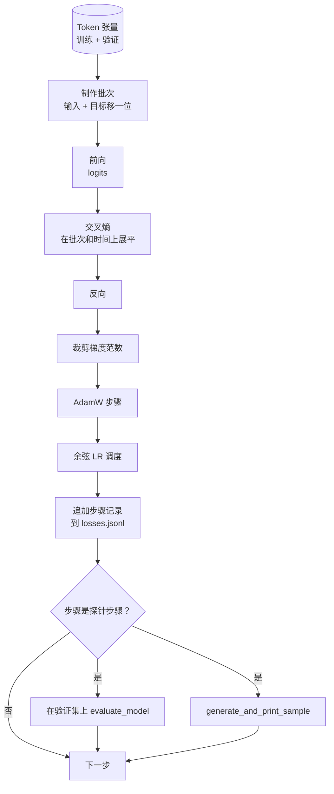

# 训练循环和评估（Training Loop and Evaluation）

> 不测量的循环是说谎的循环。本课构建驱动 GPT 模型的训练循环：带权重衰减分割的 AdamW、预热加余弦学习率调度、`calc_loss_batch` 助手、在保留数据上的 `evaluate_model` 通道、每 K 步的 `generate_and_print_sample` 定性探针，以及你事后可以绘制的 JSONL 损失日志。相同的骨架训练你将来构建的每个解码器 LLM。

**类型：** 构建  
**语言：** Python  
**前置知识：** Phase 19 第 30-35 课  
**预计时间：** 约 90 分钟

## 学习目标

- 构建训练循环，为下一个 token 预测以正确的输入和目标对齐计算交叉熵损失。
- 配置 AdamW，对权重张量应用权重衰减，不对层归一化或偏差张量应用。
- 实现带线性预热和余弦衰减的学习率调度，并读取随时间变化的 LR。
- 在保留分割上使用 `evaluate_model` 进行评估，使评估损失可在不同运行间比较。
- 每 K 步用 `generate_and_print_sample` 生成定性样本，在损失曲线之前捕获发散。
- 将每步损失持久化到 JSONL，以便重新加载、绘图并将训练日志作为可交付成果发布。

## 问题

只打印损失但什么都不做的训练脚本以三种方式失败。它无法告诉你损失是否因正确原因而减少（模型可能过拟合训练集而永远不学习）。它无法告诉你发散是否开始（损失可能在一步内激增并恢复，或一步后崩溃）。它无法告诉你模型学到了什么（损失是标量；生成的样本是一段话）。所有三种失败都会隐藏，除非循环进行测量。

本课的循环以三种方式测量。每步训练批次上的损失。每 K 步在保留批次上的损失。每 K 步从固定提示词生成的延续。训练日志落入 JSONL，所以工件是循环的证词。

## 核心概念



两个不明显的部分是损失对齐和 AdamW 衰减分割。

### 损失对齐

模型在每个位置预测下一个 token。如果输入批次是 token `[t0, t1, t2, t3]`，目标批次必须是 `[t1, t2, t3, t4]`。交叉熵在扁平形状 `(batch * seq, vocab)` 上对扁平目标 `(batch * seq,)` 计算。忘记移位，你训练模型预测自身，收敛到零损失但什么有用的都没学到。

### AdamW 衰减分割

权重衰减正则化权重张量，但不正则化归一化缩放或偏差。对层归一化缩放施加衰减会慢慢将缩放驱动到零并破坏归一化。对偏差施加衰减在数学上无害但浪费了周期。标准分割是：矩阵形状张量（线性权重、嵌入表）获得衰减，看起来像缩放或移位的任何内容都不获得。

### 预热加余弦调度

预热在几百步内将学习率从零提升到目标，使优化器状态有时间填充。余弦衰减在剩余步骤中将学习率降回零附近，使最终阶段以小步长微调权重。这种组合是开放权重 LLM 训练中最常见的调度，因为它消除了前一千步和最后一千步中的大多数脆弱时刻。

### 保留评估

`evaluate_model` 从验证分割运行固定数量的批次，累积损失，除以批次数，然后返回。没有梯度。没有 dropout。给定相同种子和相同分割，数字可以跨运行复现。将保留损失与训练损失并排报告是你发现过拟合的方式。

### 定性采样作为早期信号

训练损失下降良好但生成样本都是同一个 token 的模型是坏的。损失曲线看起来平坦但生成样本锐化为连贯词语的模型在学习。定性探针比读取完整曲线运行更快，捕获标量错过的模式。

## 构建它

`code/main.py` 实现：

- `make_batches(token_ids, batch_size, context_length)`：将长 token 张量切片为输入和目标对。
- `calc_loss_batch(model, inputs, targets)`：前向传递，展平，返回标量交叉熵。
- `evaluate_model(model, val_loader, max_batches)`：无梯度迭代固定数量的验证批次，返回平均损失。
- `generate_and_print_sample(model, prompt, max_new_tokens)`：在固定提示词上运行第 35 课的生成函数并打印结果。
- `build_param_groups(model, weight_decay)`：生成两组 AdamW 参数列表。
- `cosine_with_warmup(step, warmup_steps, total_steps, max_lr, min_lr)`：返回给定步骤的 LR。
- `train(...)`：运行循环，持久化 `outputs/losses.jsonl`，每 `eval_every` 步打印评估损失和样本。
- 演示：在合成数据上训练小型模型少量步骤，写入 JSONL 日志，在探针点打印评估损失和样本。演示在 CPU 上在一分钟内完成。

运行它：

```bash
python3 code/main.py
```

输出：每步损失行，每个探针步骤的评估损失，每个探针步骤的生成样本，以及最终的 `outputs/losses.jsonl`，你可以用每行 `json.loads` 加载。

## 关键术语

| 术语 | 通俗说法 | 准确含义 |
|------|----------|----------|
| Loss alignment（损失对齐） | "移一位" | 位置 0..T-1 的输入 token，位置 1..T 的目标 token；交叉熵在扁平形状上计算 |
| Decay split（衰减分割） | "两组" | AdamW 接收带权重衰减的矩阵形状张量和不带衰减的缩放或偏差张量 |
| Warmup（预热） | "斜坡" | 学习率在固定步数内从零爬升到目标，使优化器状态可以填充 |
| Eval batches（评估批次） | "保留批次" | 验证 token 张量的固定切片，在脚本开始时切片一次，每次探针使用相同批次 |
| Qualitative probe（定性探针） | "样本打印" | 每 K 步从固定提示词打印的短生成，捕获损失单独隐藏的失败模式 |

## 延伸阅读

- Phase 19 第 35 课，循环驱动的模型。
- Phase 19 第 37 课，将预训练权重加载到相同模型。
- Phase 10 第 04 课（预训练迷你 GPT），在真实数据上的程序。
- Phase 10 第 10 课（评估），超出交叉熵损失的更广泛评估界面。
