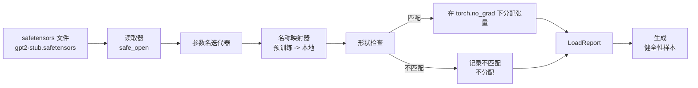

# 加载预训练权重（Loading Pretrained Weights）

> 从头训练 1.24 亿参数模型是一个预算决策；加载已发布的检查点是一件普通的事。本课将 GPT-2 风格的预训练权重从 safetensors 文件加载到第 35 课的精确架构中，逐一解析参数名称映射，并通过健全性生成延续来证明加载成功。没有网络，没有第三方加载器，没有不透明的魔法。

**类型：** 构建  
**语言：** Python  
**前置知识：** Phase 19 第 30-36 课  
**预计时间：** 约 90 分钟

## 学习目标

- 用 `safetensors` Python 库读取 safetensors 文件，检查张量名称和形状。
- 将每个预训练参数名称映射到第 35 课 GPT 模型中的参数。
- 处理已发布 GPT-2 权重和本 Track 模型之间不同的两种名称约定：`wte/wpe/h.N.attn.c_attn/c_proj` 和 `mlp.c_fc/c_proj` 与本地命名的 `tok_embed/pos_embed/blocks.N.attn.qkv/out_proj` 和 `mlp.fc1/fc2`。
- 在任何权重分配发生之前以清晰错误检测并拒绝形状不匹配。
- 用加载的权重生成短延续，确认 token 来自加载的分布，而非随机初始化的。

## 问题

已发布的权重不是为你的架构打包的。它们携带原始实现使用的名称。预训练文件有形状为 `(2304, 768)` 的 `transformer.h.0.attn.c_attn.weight`；你的模型期望形状为 `(2304, 768)` 的 `blocks.0.attn.qkv.weight`（同一矩阵在不同布局约定下）或你的模型使用 `nn.Linear`，它以转置方式存储矩阵。同一参数以三种微妙不同的身份（名称、形状、字节布局）出现，加载器必须调和所有三者。

盲目复制的加载器将正确张量放到错误位置，你得到一个生成无意义内容的模型。当形状不同时拒绝复制但不记录任何内容的加载器让你猜哪个张量没有落地。本课的加载器是明确的：每次分配都被记录，每个形状都被检查，`LoadReport` 总结命中、未命中和形状不匹配，这样你可以读取发生了什么。

## 核心概念

名称映射器只是一个从字符串到字符串的函数。形状检查是一个 if。分配在 `torch.no_grad()` 内发生，使自动微分不追踪加载。报告保存每个名称的结果。

### GPT-2 名称约定

已发布 GPT-2 权重的名称如下：

| 预训练名称 | 形状 | 含义 |
|-----------|------|------|
| `wte.weight` | (50257, 768) | Token 嵌入 |
| `wpe.weight` | (1024, 768) | 位置嵌入 |
| `h.N.ln_1.weight` | (768,) | 块 N 的层归一化 1 缩放 |
| `h.N.ln_1.bias` | (768,) | 层归一化 1 移位 |
| `h.N.attn.c_attn.weight` | (768, 2304) | 融合 QKV 线性权重 |
| `h.N.attn.c_attn.bias` | (2304,) | 融合 QKV 线性偏差 |
| `h.N.attn.c_proj.weight` | (768, 768) | 注意力输出投影 |
| `h.N.attn.c_proj.bias` | (768,) | 注意力输出投影偏差 |
| `h.N.ln_2.weight` | (768,) | 层归一化 2 缩放 |
| `h.N.ln_2.bias` | (768,) | 层归一化 2 移位 |
| `h.N.mlp.c_fc.weight` | (768, 3072) | MLP fc1 权重 |
| `h.N.mlp.c_fc.bias` | (3072,) | MLP fc1 偏差 |
| `h.N.mlp.c_proj.weight` | (3072, 768) | MLP fc2 权重 |
| `h.N.mlp.c_proj.bias` | (768,) | MLP fc2 偏差 |
| `ln_f.weight` | (768,) | 最终层归一化缩放 |
| `ln_f.bias` | (768,) | 最终层归一化移位 |

需要规划的两个惊喜。`c_attn`、`c_proj`、`c_fc` 线性相对于 `nn.Linear.weight` 期望的存储为转置形式。加载器在分配期间转置。LM 头根本不在文件中；模型依赖与 `wte` 的权重绑定，所以头通过 `wte` 落地后别名设置。

## 关键术语

| 术语 | 通俗说法 | 准确含义 |
|------|----------|----------|
| Name map（名称映射） | "键重映射" | 从预训练张量名称到本地参数名称的函数；通常是字面字典，每层索引一个条目在循环中展开 |
| Shape mismatch（形状不匹配） | "错误形状" | 预训练张量在映射名称下存在，但其维度与本地参数不一致；加载器拒绝分配并记录对 |
| Transpose-on-load（加载时转置） | "Conv1d 布局" | 已发布 GPT-2 以 nn.Linear 期望的转置存储注意力和 MLP 投影；加载器在分配期间转置 |
| Weight tying alias（权重绑定别名） | "共享 LM 头" | 设置 model.lm_head.weight = model.tok_embed.weight 使头和嵌入共享存储；头因此不在文件中 |
| Load report（加载报告） | "覆盖率摘要" | 追踪 loaded、missing、unexpected 和 shape_mismatch 列表的小型数据类；打印它是判断加载是否成功的方式 |

## 延伸阅读

- Phase 19 第 35 课，接收权重的架构。
- Phase 19 第 36 课，产生相同形状检查点的训练循环。
- Phase 10 第 11 课（量化），内存紧张时处理加载权重的方法。
- Phase 10 第 13 课（构建完整 LLM 管道），围绕加载和推断的完整生命周期。
