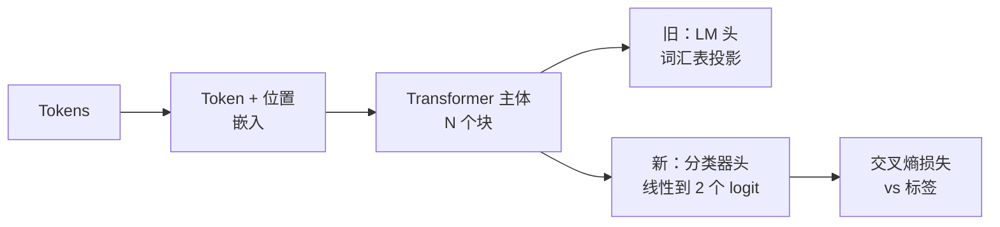

# 压轴项目第 38 课：通过头替换进行分类器微调（Capstone Lesson 38: Classifier Fine-Tuning by Head Swap）

> Track B 的第一个压轴项目。预训练语言模型是以 token 预测头结尾的自注意力块堆叠。当你想要垃圾邮件 vs 正常邮件时，头是错的，但主体大部分是对的。本课将头去掉，在池化表示上粘上一个两类线性层，并用两种不同方式训练分类器：仅最后一层，和完全微调。评估是保留分割上的精度、召回和 F1。你学到每种策略能给你带来什么以及它的代价是什么。

**类型：** 构建  
**语言：** Python（torch，numpy）  
**前置知识：** Phase 19 第 30-37 课（NLP LLM Track：分词器，嵌入表，注意力块，Transformer 主体，预训练循环，检查点，生成，困惑度）  
**预计时间：** 约 90 分钟

## 学习目标

- 在不重新初始化主体的情况下，用分类头替换语言模型头。
- 实现两种训练方式：冻结主体（仅头部）和完全微调，共享一个训练循环。
- 构建分词器感知的数据管道，填充、掩码填充，并池化注意力输出。
- 从原始 logit 计算精度、召回、F1 和混淆矩阵。
- 推理参数数量、训练时间和头部空间之间的权衡。

## 问题

你在通用语料库上预训练了一个小型 Transformer。输出头将最后隐藏状态投影到 1000 token 的词汇表。你现在有 800 条标注为垃圾邮件或正常邮件的 SMS 消息，你想要一个二元分类器。存在三个选项。

错误的选项是在 800 个样本上从头训练新的分类器。预训练模型的主体已经编码了有用的结构：词语身份、位置、简单的共现。丢掉它会浪费构建它的计算。

两个正确的选项是冻结主体的头替换，以及可训练主体的头替换。仅头部训练快，内存几乎免费，在这点数据上几乎不会过拟合。完全微调更慢，在小数据上可能过拟合，但当下游领域与预训练语料库偏离时达到更高准确率。

本课构建两者，以便你可以在同一夹具上比较它们。

## 核心概念

模型是函数 `f_theta(tokens) -> hidden_states`。头是函数 `g_phi(hidden) -> logits`。替换头意味着保留 `theta` 并替换 `g_phi`。主体的参数是昂贵的部分。头是单个线性层。

两组可训练参数很重要：

- `theta`（主体）：每个注意力块数万个权重。
- `phi`（头）：`hidden_dim * num_classes` 权重加偏差。

在仅头部训练中，你计算对 `phi` 的梯度，对 `theta` 清零。PyTorch 通过对主体参数设置 `requires_grad=False` 让你做到这一点。优化器只看到头，主体保持冻结。

在完全微调中，你让梯度流回整个堆叠。主体的权重偏移以适应分类目标。风险是小数据上的灾难性遗忘：主体的预训练被过拟合噪声冲洗掉。

## 池化问题

分类器每个序列需要一个向量，而非每个 token 一个向量。三种常见选择：

- **均值池化**：对序列中的隐藏状态取平均，按注意力掩码加权。
- **CLS 池化**：前置一个特殊 token，只使用其输出。这是 BERT 所做的。
- **最后 token 池化**：使用最后一个非填充 token。这是 GPT 类分类器所做的。

本课使用带显式注意力掩码加权的均值池化。这是最简单的，在各种序列长度上给出稳定信号，不需要预训练 CLS token。

## 关键术语

| 术语 | 通俗说法 | 准确含义 |
|------|----------|----------|
| Head swap（头替换） | "替换输出层" | 保留预训练主体参数，用新的特定任务头替换语言模型头 |
| Frozen body（冻结主体） | "仅头部训练" | 主体参数的 requires_grad=False；只有头接收梯度 |
| Full fine-tuning（完全微调） | "微调全部" | 主体和头都接收梯度；更慢，小数据上风险更大 |
| Mean pooling（均值池化） | "平均隐藏状态" | 跨序列长度的掩码加权平均，给分类器一个固定大小的向量 |
| Precision（精度） | "阳性预测值" | TP / (TP + FP)；预测为正的真正正例比例 |
| Recall（召回） | "敏感度" | TP / (TP + FN)；被捕获的实际正例比例 |
| F1 | "调和均值" | 2 * P * R / (P + R)；精度和召回的平衡综合 |
