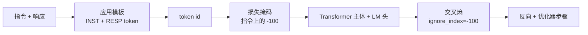

# 压轴项目第 39 课：通过监督微调进行指令调优（Capstone Lesson 39: Instruction Tuning by Supervised Fine-Tuning）

> 预训练基础模型可以扩展序列，但无法遵循指令。监督微调是修复这个问题的最小变化：向模型提供指令和所需响应的成对样例，训练主体预测响应 token。技巧是你只想让损失计算响应，而非指令。本课构建 Alpaca 风格的 SFT 循环，带有自定义收集函数，用 `ignore_index=-100` 掩码指令 token，在 200 个指令-响应对上训练，并使用精确匹配在保留分割上评估。

**类型：** 构建  
**语言：** Python（torch，numpy）  
**前置知识：** Phase 19 第 30-37 课（NLP LLM Track：分词器，嵌入表，注意力块，Transformer 主体，预训练循环，检查点，生成，困惑度）  
**预计时间：** 约 90 分钟

## 学习目标

- 将成对的指令-响应数据格式化为带显式边界 token 的单个因果序列。
- 构建一个收集函数，掩码指令 token，使交叉熵只计算响应 token。
- 在 SFT 目标下训练小型 Transformer 主体，观察评估指标变化。
- 实现尊重响应开始边界的贪婪和温度采样生成。
- 计算生成补全的保留精确匹配。

## 问题

在下一个 token 预测上训练的基础模型不知道什么是指令。给它字符串 `"法国的首都是什么？"`，它将继续问题或发明一个新句子。模型有语言但没有格式契约。

SFT 契约是字符串模板。每个训练样例变成带三个区域的单个序列：

```text
<INST> 法国的首都是什么？ <RESP> 法国的首都是巴黎。
```

边界 token 是在训练时保留的特殊 token。模型学到 `<RESP>` 之后的所有内容是响应，响应是被评分的。基础模型的下一个 token 目标仍然适用；只是在每个样例都有这种形状的语料库上训练。

但有一个问题。如果你将整个序列提供给普通交叉熵损失，你正在训练模型也预测指令 token。指令是给定的。你希望在这些位置有零梯度。修复是掩码。

## 核心概念



`ignore_index` 是 `torch.nn.functional.cross_entropy` 的特性。任何等于 `ignore_index` 的目标位置贡献零损失和零梯度。PyTorch 中的约定是 `-100`。收集函数每个样例构建两个张量：`input_ids`（完整序列）和 `labels`（`input_ids` 的副本，指令位置被 `-100` 覆写）。

模型在前向传递中看到整个序列；注意力可以关注指令。损失只计算响应 token。这正是你想要的：以指令为条件，预测响应。

## 关键术语

| 术语 | 通俗说法 | 准确含义 |
|------|----------|----------|
| SFT（监督微调） | "指令调优" | 在成对指令-响应样例上微调，仅对响应 token 计算损失 |
| Loss mask（损失掩码） | "指令掩码" | 将指令位置的目标设为 -100，使交叉熵在这些位置产生零梯度 |
| Instruction template（指令模板） | "格式契约" | [INST]...[RESP] 格式，告诉模型指令在哪里结束，响应从哪里开始 |
| Exact-match（精确匹配） | "严格文本指标" | 归一化预测响应与参考的字符级比较；每个样例 1 或 0 |
| Collate function（收集函数） | "批次构建器" | 收集样例、填充到批次中的最大长度、应用损失掩码 |
