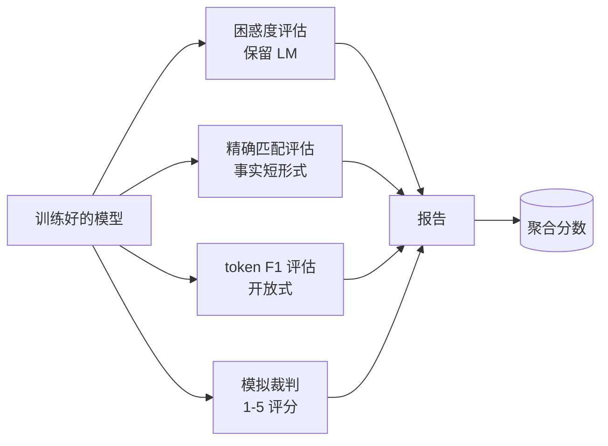

# 压轴项目第 41 课：完整评估管道（Capstone Lesson 41: Full Evaluation Pipeline）

> 训练是你可以用损失曲线监控的部分。评估是你必须设计的部分。本课构建统一的评估管道，接受任何训练好的语言模型，对其运行四种异构评估，将结果聚合为每任务报告，并提供本地模拟 LLM 作为裁判，使循环无需网络即可运行。四种评估涵盖每个发布模型需要的维度：语言建模（困惑度）、短形式正确性（精确匹配）、开放形式相似性（token F1）和定性评分（裁判）。

**类型：** 构建  
**语言：** Python（torch，numpy）  
**前置知识：** Phase 19 第 30-37 课（NLP LLM Track：分词器，嵌入表，注意力块，Transformer 主体，预训练循环，检查点，生成，困惑度）  
**预计时间：** 约 90 分钟

## 学习目标

- 在小型 Transformer 上使用掩码 token 计数计算保留困惑度。
- 在短形式事实提示词上运行精确匹配评估。
- 计算预测和参考字符串之间的 token 级 F1 并进行归一化。
- 构建在 1-5 分量表上对模型输出评分的本地模拟 LLM 作为裁判。
- 将四种评估聚合成带每任务分解的单一加权报告。

## 核心概念

四个评估覆盖其他评估遗漏的维度：

- **困惑度**：`exp(每 token 平均负对数似然)`。必须仅对实际 token 位置（不含填充）计算均值。
- **精确匹配**：归一化后的精确字符串比较（小写，去除空白，折叠空格）。
- **Token F1**：标记集合的精度和召回的调和均值；宽恕同义改述但不被词汇重叠愚弄。
- **LLM 作为裁判**：确定性模拟裁判，将分数 1-5 映射到词汇 F1 阈值。真实系统可以交换为真正的模型。

聚合是归一化评估分数的加权均值：困惑度 `1 / (1 + log(ppl))` 归一化，精确匹配和 F1 已在 `[0, 1]`，裁判除以 5。默认权重：困惑度 0.2，精确匹配 0.3，token F1 0.3，裁判 0.2。

## 关键术语

| 术语 | 通俗说法 | 准确含义 |
|------|----------|----------|
| Perplexity（困惑度） | "LM 拟合度" | exp(每 token 均值 NLL)；不含填充位置 |
| Exact-match（精确匹配） | "严格文本指标" | 归一化后的字符串相等；0 或 1 每个样例 |
| Token F1 | "词汇重叠" | 标记袋精度和召回的调和均值 |
| LLM judge（LLM 裁判） | "定性评分器" | 对模型输出相对于参考评分的模型（或模拟）；1-5 分量表 |
| Weighted aggregate（加权聚合） | "综合分数" | 归一化后每个指标的加权均值；权重是产品决策 |
