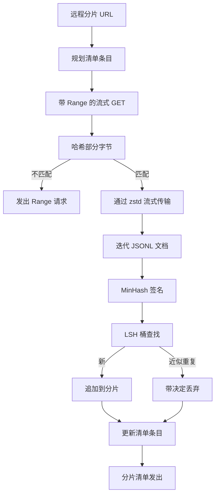

# 大型语料库下载器（Large Corpus Downloader）

> 训练语言模型在第一次前向传递之前很久就开始了。语料库必须落到磁盘上，解压缩，去重，可寻址，并且在网络在 4% 时中断之前就已经制定好恢复策略。本课构建流式下载器，拉取压缩分片，用 Zstandard 即时解压，通过 MinHash 加局部敏感哈希对近似重复进行指纹识别，并写入管道其余部分可以信任的分片清单。

**类型：** 构建  
**语言：** Python  
**前置知识：** Phase 19 第 30-37 课  
**预计时间：** 约 90 分钟

## 学习目标

- 用 `urllib` 流式传输远程分片，用 `zstandard` 即时解压，不在内存中缓冲整个文件。
- 通过向已验证字节偏移发出 HTTP `Range` 请求来恢复部分下载。
- 为每个文档构建 MinHash 签名，并用 LSH 进行桶化，使近似重复碰撞。
- 发出带内容哈希、字节大小、文档数量和去重决定的分片清单。

## 核心概念

**流式传输**：标准库 `urllib.request.urlopen` 返回类文件对象。将其包装在 `zstandard.ZstdDecompressor().stream_reader` 中，字节从网络通过解压器流向文档迭代器，无需在内存中实例化压缩或解压缩的分片。

**恢复**：下载器为每个分片写入两个文件：分片本身和 `.partial.json` 检查点。检查点记录 `verified_bytes`、`expected_size`、`sha256_prefix` 和源 URL。在启动时，下载器重新计算磁盘上字节的前缀哈希并仅在匹配时恢复。

**MinHash + LSH**：MinHash 用固定空间估计两个集合的 Jaccard 相似度。对于文档，集合是其文本的词语串（重叠 n-gram）。签名是 `k` 个最小哈希值。LSH 将 `k` 个分量分成 `b` 个每组 `r` 行的带，在任何一个带中碰撞的阈值约为 Jaccard 相似度 `(b, r)` 参数调整的目标。

## 关键术语

| 术语 | 通俗说法 | 准确含义 |
|------|----------|----------|
| Shard（分片） | "一个文件" | 带自己 sha256 的语料库自包含切片，用作恢复和去重的单元 |
| MinHash signature（MinHash 签名） | "指纹" | 集合的 k 分量草图，每个分量是集合上一个独立哈希的最小值 |
| LSH band（LSH 带） | "桶" | 用作单个桶键进行碰撞检测的 r 个签名分量组 |
| Verified bytes（已验证字节） | "恢复偏移" | 磁盘上 sha256 前缀与检查点匹配的字节；唯一安全的恢复偏移 |
| Manifest（清单） | "索引" | 下载器产生的内容的单一持久记录，包括内容哈希 |
