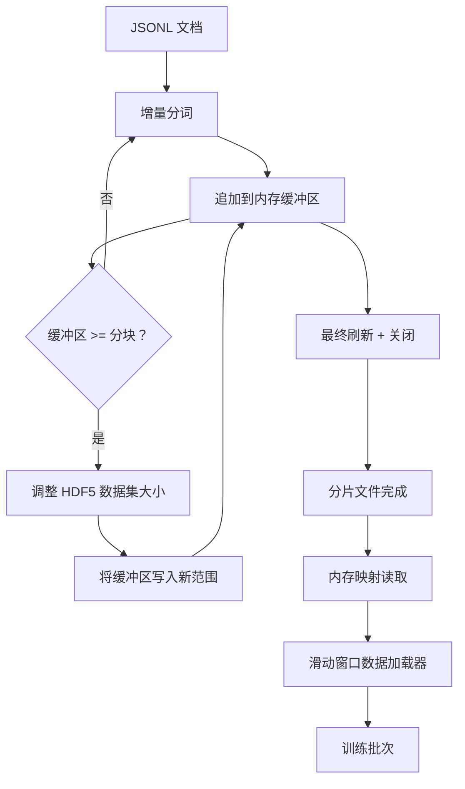

# HDF5 分词语料库（HDF5 Tokenized Corpus）

> 下载的语料库必须以训练器可以以行速度流式传输的布局落地。JSONL 不能在 16 个数据加载器工作者下存活。带可调整大小、分块整数数据集的 HDF5 可以。本课将流式分词构建到可调整大小的 HDF5 数据集中，分片写入多个文件，训练时内存映射读取，以及生成带正确打包规则的固定长度序列的滑动窗口数据加载器。

**类型：** 构建  
**语言：** Python  
**前置知识：** Phase 19 第 30-37 课  
**预计时间：** 约 90 分钟

## 学习目标

- 将文档流式传输到带确定性分块的可调整大小 HDF5 整数数据集中。
- 将写入分片到多个 HDF5 文件，使失败有界且并行性成为可能。
- 通过 HDF5 的页面缓存支持的分块布局读回 token，使数据加载器仅在批次时间复制到批次缓冲区。
- 实现发出带显式打包规则的固定长度训练序列的滑动窗口数据加载器。

## 核心概念

**可调整大小的 HDF5**：token 数据集用 `maxshape=(None,)` 和固定 `chunks=(chunk_size,)` 创建。当缓冲区填满时，数据集调整大小恰好 `chunk_size`，缓冲区写入新范围。每次写入都是连续的并且分块对齐，除了最后一个（读取器被告知在记录的 `token_count` 处截断）。

**分片写入**：每个输入分片产生一个 HDF5 输出分片。`shards.json` 索引记录每个分片的文件路径、token 数量、文档数量和 token 上的 sha256。

**内存映射读取**：训练时每个工作者以 `swmr=True` 模式打开分片，请求 `tokens[start:stop]`。HDF5 的分块布局一旦分块热起来就是页面缓存支持的读取。

**滑动窗口**：从全局 token 流中选择随机起始索引，读取 `window_size + 1` 个 token，返回 `(input, target) = (tokens[:-1], tokens[1:])`。文档边界不被强制：窗口可能跨越两个文档，之间有显式 `boundary_token_id`。

## 关键术语

| 术语 | 通俗说法 | 准确含义 |
|------|----------|----------|
| Resizable dataset（可调整大小的数据集） | "仅追加" | 带 `maxshape=(None,)` 的 HDF5 数据集，通过分块步长的 `resize` 调用增长 |
| Chunked layout（分块布局） | "HDF5 的存储方式" | 内核可以内存映射且数据加载器可以连续读取的固定大小磁盘页面 |
| `swmr` mode | "边读边写" | 单写者多读者模式，让数据加载器工作者安全共享文件 |
| Shard index（分片索引） | "shards.json" | 所有 token 分片带偏移和内容哈希的持久索引 |
| Sliding window（滑动窗口） | "训练样本" | 全局 token 流的固定长度切片，训练器与其移一位目标配对 |
