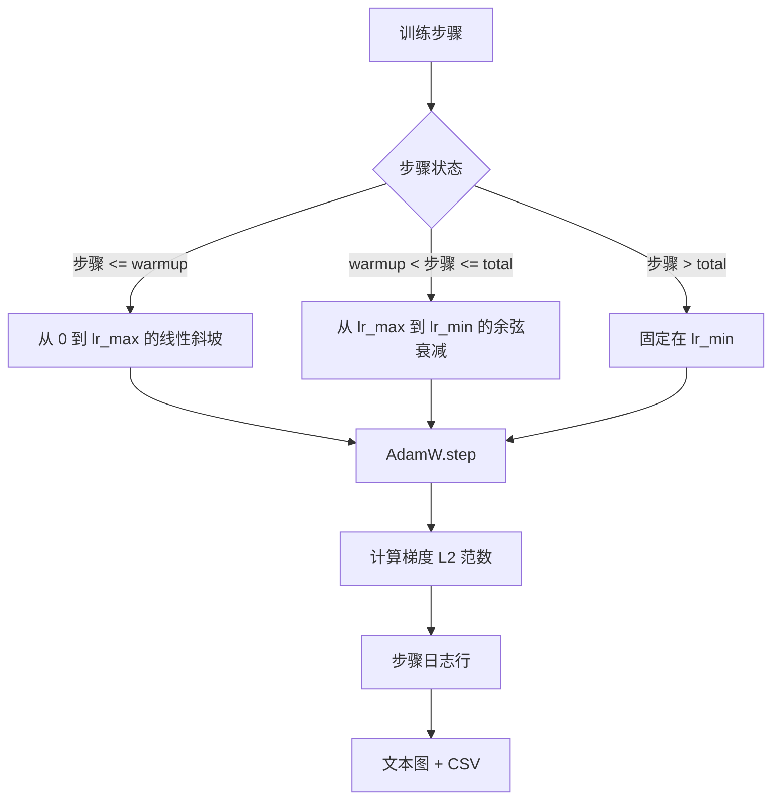

# 带线性预热的余弦学习率（Cosine LR with Linear Warmup）

> 学习率调度是损失函数之后第二重要的决策。带余弦衰减和线性预热的 AdamW 是现代语言模型训练的默认选择，因为它让模型在脆弱的前一千次更新期间看到小的有效步长，提升到配置的峰值，并平滑地衰减回零。本课构建该调度，绘制训练步数上的曲线，在调度旁边记录梯度范数，并证明调度遵守预热、峰值和衰减边界。

**类型：** 构建  
**语言：** Python  
**前置知识：** Phase 19 第 30-37 课  
**预计时间：** 约 90 分钟

## 核心概念

**预热公式**：步骤 `[0, warmup_steps]` 中，学习率为 `lr_max * step / warmup_steps`。

**余弦公式**：步骤 `(warmup_steps, total_steps]` 中，学习率为 `lr_min + 0.5 * (lr_max - lr_min) * (1 + cos(pi * progress))`，其中 `progress = (step - warmup_steps) / max(1, total_steps - warmup_steps)`。两端的连续性确保了无缝转换。

**超过 total_steps 后的下限**：学习率固定在 `lr_min`，不报错也不外推。

**梯度范数日志**：调度是训练健康状况的一半。梯度范数是另一半。每步记录两者。发散的训练运行在损失之前显示梯度范数峰值。

## 关键术语

| 术语 | 通俗说法 | 准确含义 |
|------|----------|----------|
| Warmup（预热） | "慢启动" | 在前 `warmup_steps` 次更新中从零到 `lr_max` 的线性提升 |
| Cosine decay（余弦衰减） | "平滑下降" | 在剩余步骤中从 `lr_max` 到 `lr_min` 的上半余弦曲线 |
| Floor（下限） | "训练后" | `lr_min` 固定值，调度在超过 `total_steps` 后固定在此 |
| Gradient norm（梯度范数） | "梯度的 L2" | 连接梯度向量的欧几里得范数，每步记录 |
| Global step（全局步骤） | "调度轴" | 在重启后存活并驱动调度的单调步骤计数器 |
