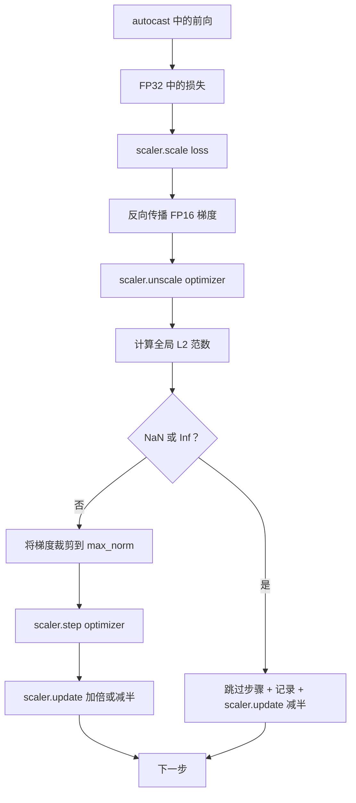

# 梯度裁剪和混合精度（Gradient Clipping and Mixed Precision）

> 上一课的优化器和调度假设梯度是合理的。通常不是这样。单个糟糕的批次可以将梯度范数提升三个数量级。混合精度训练通过在损失侧引入 FP16 溢出放大了这一问题。本课构建生产训练不能没有的两条安全带：对配置的全局 L2 范数的梯度裁剪，以及带 autocast 和 GradScaler 的混合精度循环，检测 NaN 和 Inf，干净地跳过步骤，并记录缩放因子用于取证。

**类型：** 构建  
**语言：** Python  
**前置知识：** Phase 19 第 30-37 课  
**预计时间：** 约 90 分钟

## 核心概念

正确的操作顺序：`scaler.scale(loss).backward()`，然后 `scaler.unscale_(optimizer)`，然后 `clip_grad_norm_`，然后 `scaler.step(optimizer)`，然后 `scaler.update()`。任何其他顺序都会产生静默损坏的循环。

**全局 L2 范数**：所有可训练参数的连接梯度向量的欧几里得范数，不是每参数范数。

**autocast 和 GradScaler**：`autocast` 选择性地以 FP16 运行符合条件的操作。`GradScaler` 在反向传播前缩放损失，在优化器步骤前反向缩放梯度。

**NaN 和 Inf 检测**：在两个地方：反向传播前的损失本身，以及 `unscale_` 后的梯度。如果检测到任何问题，步骤被跳过，缩放因子减半。

## 关键术语

| 术语 | 通俗说法 | 准确含义 |
|------|----------|----------|
| Global L2 norm（全局 L2 范数） | "裁剪目标" | 所有可训练参数连接梯度向量的欧几里得范数 |
| autocast | "混合精度" | 在 `with` 块内选择性地以 FP16（或 BF16）执行符合条件的操作 |
| GradScaler | "损失缩放器" | 在反向传播前乘以损失并在优化器步骤前反向缩放梯度的助手 |
| Skip（跳过） | "坏步骤" | 因梯度或损失不是有限值而被拒绝的优化器步骤；缩放器减半因子 |
| Scaling factor（缩放因子） | "缩放器状态" | GradScaler 当前乘数；干净步骤后加倍，每次跳过后减半 |
