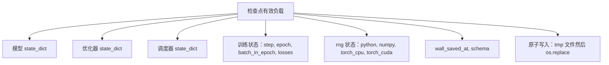

# 检查点保存和恢复（Checkpoint Save and Resume）

> 训练中断会杀死运行；检查点让它们继续。以原子方式保存模型、优化器、调度器、损失历史、步骤计数器和 RNG 状态，这样在任何时刻的终止都会在磁盘上留下有效文件。

**类型：** 构建  
**语言：** Python  
**前置知识：** Phase 19 第 42-45 课  
**预计时间：** 约 90 分钟

## 核心概念

**五个状态桶**：模型（权重和缓冲区）、优化器（动量和自适应矩，没有这些下一步是不同的优化问题）、调度器（学习率在曲线上的位置）、训练计数器（步骤、epoch、epoch 内批次、损失历史）、RNG 状态（dropout、数据洗牌和模型内任何采样的确定性）。

**原子保存**：写入目标目录中的临时文件，然后 `os.replace` 换入最终名称。崩溃不留下半写文件。两条规则：临时文件在同一目录中（跨设备重命名不是原子的），临时名称每次尝试唯一。

**分片检查点**：当模型变大时，将参数状态分割成分片，写入绑定它们的小索引。索引记录每个分片的 sha256。加载器在任何哈希不匹配时大声失败。

**epoch 中间恢复**：`(epoch, batch_in_epoch)` 加 RNG 状态。恢复后，训练循环快速转发随机数生成器，跳过当前 epoch 中已消耗的批次，从 `batch_in_epoch` 继续。

## 关键术语

| 术语 | 通俗说法 | 准确含义 |
|------|----------|----------|
| Atomic save（原子保存） | "写入并祈祷" | 写入同一目录中的临时文件，然后 os.replace 到目标名称 |
| State dict（状态字典） | "权重" | 按参数名称键控的模型参数和缓冲区 |
| Sharded checkpoint（分片检查点） | "大模型文件" | 多个文件，每个分片一个，加上带 sha256 的元文件和 JSON 索引 |
| RNG state（RNG 状态） | "随机种子" | 捕获的 python random、numpy、torch CPU、torch CUDA 状态；不只是种子 |
| Mid-epoch resume（epoch 中间恢复） | "重启" | 快进 RNG，从同一 epoch 的下一批次继续 |
