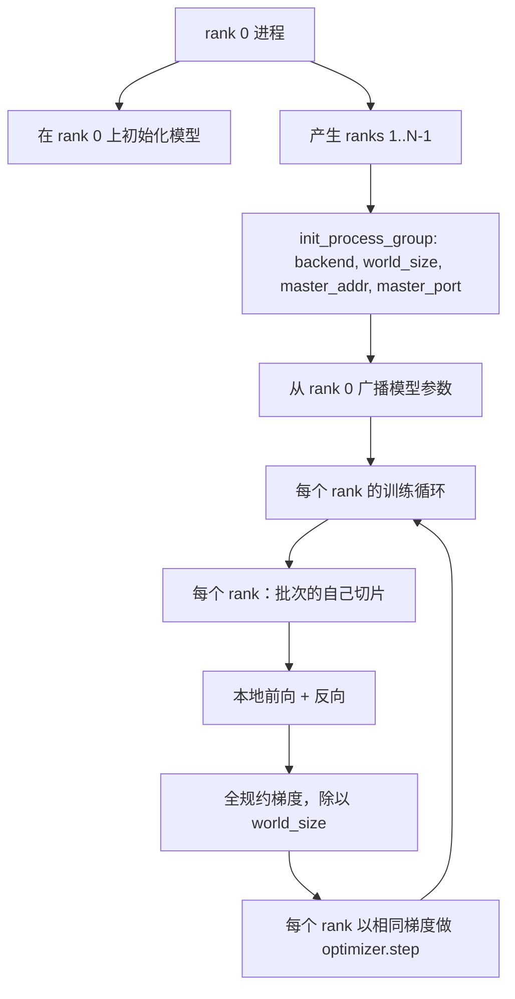

# 分布式数据并行和 FSDP（Distributed Data Parallel and FSDP from Scratch）

> 多排训练是两个集合通信和一个规则。启动时广播参数，反向传播后平均梯度，永远不让排之间对它们处于哪个步骤产生分歧。

**类型：** 构建  
**语言：** Python  
**前置知识：** Phase 19 第 42-45 课  
**预计时间：** 约 90 分钟

## 核心概念

**两个重要集合通信**：

| 集合通信 | 作用 | 时机 |
|---------|------|------|
| `broadcast` | 从一个 rank 复制张量到所有其他 rank | 参数初始化、调度器状态、任何一对多同步 |
| `all_reduce` | 对所有 rank 的张量求和（或均值），每个 rank 得到结果 | 反向传播后的梯度平均 |
| `all_gather` | 每个 rank 贡献一个张量，每个 rank 得到连接 | Logit 收集，FSDP 参数反分片 |

**梯度平均等价于单进程梯度**：在 N 个 rank 上对 B 个样本的批次训练的模型，必须产生与单进程在 N*B 批次上训练相同的梯度。

**FSDP 草图**：将每个参数展平，分成 N 个相等的平坦分片，每个 rank 持有一个分片。在前向传递前全收集，使用完整张量，前向后丢弃完整张量，只保留分片。内存节省精确为 1/N。

## 关键术语

| 术语 | 通俗说法 | 准确含义 |
|------|----------|----------|
| Backend（后端） | "gloo 或 nccl" | 实现集合操作的库；gloo 用于 CPU，nccl 用于 GPU |
| World size（世界大小） | "总排数" | 组中的进程数；组是集合通信操作的单位 |
| Rank（排） | "工作者 id" | 组内的进程标识符，从零开始索引 |
| All-reduce（全规约） | "对梯度求和" | 对所有 rank 的张量求和，每个 rank 以相同结果结束 |
| Unshard（反分片） | "收集参数" | 通过 all_gather 从每 rank 切片重建完整张量 |
