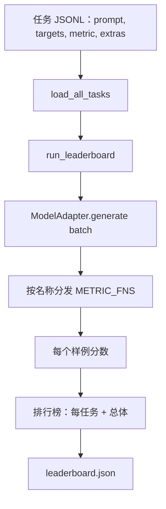

# 语言模型评估测试框架（Language Model Evaluation Harness）

> 在你无法定义的任务上表现良好的模型是偶然表现良好的模型。测试框架是任务定义、指标、运行器和排行榜，集于一个简短、可替换的形状中。

**类型：** 构建  
**语言：** Python  
**前置知识：** Phase 19 第 42-45 课  
**预计时间：** 约 90 分钟

## 核心概念

**任务规范**：每个样例是一行 JSONL：`{"id": ..., "prompt": ..., "targets": [...], "metric": "..."}`。对于需要评分助手的指标，`extras` 携带辅助有效负载。

**五个夹具任务**：算术（精确匹配）、摘要（rouge_l）、代码执行（code_exec，用 I/O 对检查函数）、多项选择（multiple_choice）、生成（substring_contains）。

**指标契约**：每个指标都是从 `(prediction, targets, extras) -> float [0.0, 1.0]` 的函数。测试框架平均每个样例分数以获得任务分数，然后平均任务分数获得总体。

**模型适配器**：测试框架唯一与模型相关的代码——`generate(prompts) -> list[str]`。交换适配器，排行榜移动；其他一切保持不变。

## 关键术语

| 术语 | 通俗说法 | 准确含义 |
|------|----------|----------|
| Task spec（任务规范） | "评估格式" | 每个样例带 prompt、targets、metric、可选 extras 的 JSONL 文件 |
| Metric（指标） | "评分方式" | 从 (prediction, targets, extras) 到 [0, 1] 中浮点数的函数 |
| Adapter（适配器） | "模型客户端" | 带 generate(prompts) -> list[str] 方法的对象；唯一与模型相关的代码 |
| Leaderboard（排行榜） | "记分板" | 带每任务分数、总计数、延迟和总体平均的 JSON |
| Code exec metric（代码执行指标） | "运行并检查" | 在受限命名空间中执行预测，与输入-输出对进行比较 |
