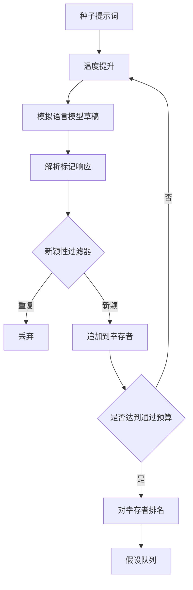

# 假设生成器（Hypothesis Generator）

> 提出同一个问题两次的研究智能体在浪费 token。技巧是强制每个草稿落在新的地方。

**类型：** 构建  
**语言：** Python  
**前置知识：** Phase 19 Track A 第 20-29 课  
**预计时间：** 约 90 分钟

## 学习目标
- 从种子提示词驱动采样器，将其输出转换为类型化假设记录。
- 在每次通过时提高采样器温度，使下一个草稿离上一个更远。
- 用小型嵌入模型和余弦距离阈值过滤近似重复。
- 用融合新颖性、特异性和可测试性的评分函数对幸存者排名。
- 保持每个步骤确定性，使相同种子始终产生相同队列。

## 架构

**温度提升**：从 `t_min` 开始，以 `(t_max - t_min) / (n_passes - 1)` 为步长提升，鼓励后期草稿探索更远。

**新颖性过滤**：解析每个草稿后，生成器嵌入文本并与每个已接受假设比较。如果与任何先前幸存者的最小距离低于 `novelty_threshold`，则拒绝。默认阈值 0.25。

**排名分数**：`rank_score = w_novelty * novelty_score + w_specificity * specificity_score + w_testability * testability_score`

假设形状：id、text、variables（实验中改变的内容）、metric（运行器将测量的内容）、baseline_ref（比较引用）、draft_pass、temperature、novelty_score、rank_score。

第 50 课产生队列。第 51 课进行文献检索。第 52 课运行实验。第 53 课写出判决。四课组合成无人参与的研究循环；人类可以在任何边界处介入。
