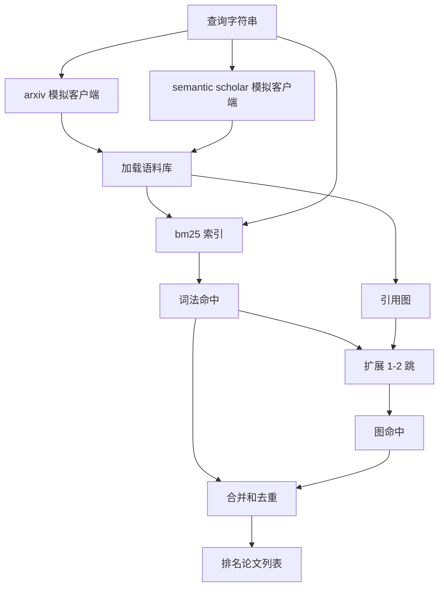

# 文献检索（Literature Retrieval）

> 假设很便宜。知道是否有人已经证明了它才是昂贵的部分。构建在运行器启动沙箱之前回答该问题的检索层。

**类型：** 构建  
**语言：** Python  
**前置知识：** Phase 19 Track A 第 20-29 课  
**预计时间：** 约 90 分钟

## 学习目标
- 用循环下游将读取的字段建模小型论文记录。
- 仅用标准库数据结构在摘要上构建 BM25 索引。
- 遍历引用图以发现词法搜索遗漏的论文。
- 通过稳定的论文 id 对词法和图通过的命中进行去重。
- 将两个模拟外部 API 包装在单个客户端后面，使上游调用站点在真实端点落地时保持不变。

## 架构

**BM25**：标准 Okapi BM25，参数 `k1=1.5`，`b=0.75`。索引是两个字典：词 -> 文档频率，词 -> (doc_id, 词计数) 列表。

**引用图遍历**：以前几个 BM25 命中为种子的广度优先搜索，上限为 2 跳。两跳是故意的上限——一跳太浅，三跳会在连通图上爆炸并偏离主题。

**去重和排名**：`final_score = w_bm25 * bm25_score_norm + w_graph * graph_score + w_recency * recency_score`

第 50 课产生假设。第 51 课检索文献看它是否已经解决。第 52 课运行实验（如果未解决）。第 53 课写出判决。检索客户端是四个阶段中最便宜的，首先运行。
