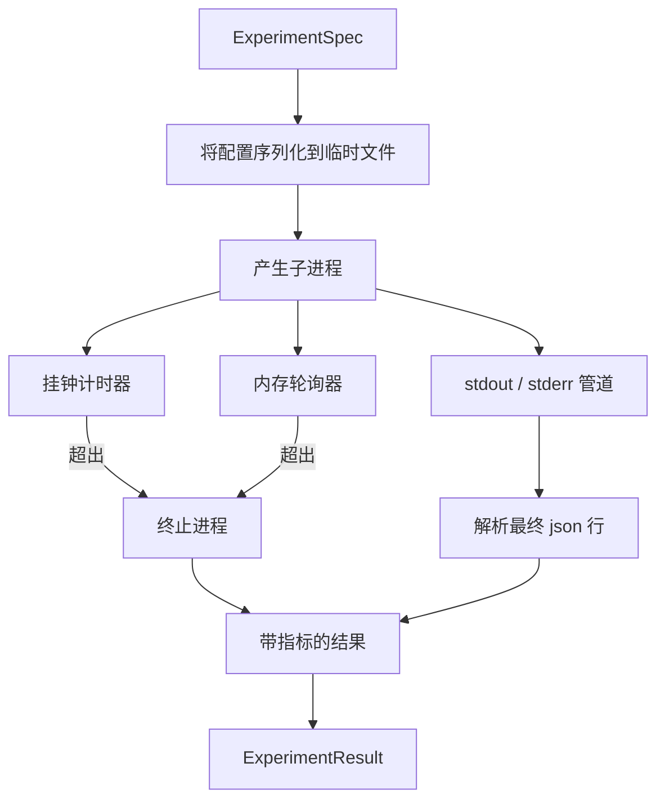

# 实验运行器（Experiment Runner）

> 循环的诚实程度取决于其测量结果。构建接受规格、在沙箱子进程中执行并发出评估器可以信任的 JSON 指标块的运行器。

**类型：** 构建  
**语言：** Python  
**前置知识：** Phase 19 Track A 第 20-29 课  
**预计时间：** 约 90 分钟

## 学习目标
- 将实验编码为运行器可以序列化到子进程的类型化规格。
- 以硬挂钟超时和软内存上限启动子进程，将两者都作为终止条件暴露。
- 将 stdout、stderr 和结构化指标块捕获到单个结果记录中。
- 构建一次扫描一个配置旋钮的消融表。
- 给定种子保持每个结果确定性，使评估器在不同运行中看到相同数字。

## 架构

**子进程隔离**：单独的进程，独立的地址空间，父侧的信号处理。没有完整沙箱，但有挂钟超时、内存轮询和两个限制都触发的终止路径。

**软内存上限**：轮询常驻集合大小，如果超过上限则终止子进程。在没有进程检查支持的系统上，轮询器记录一次性警告并禁用自身。挂钟超时仍然适用。

**消融表**：给定基础规格和旋钮名称，助手返回每个值一个规格，覆盖 `config[knob]`。一次一个旋钮产生评估器可以绘制的干净轴。

**确定性**：每个规格携带种子。运行器通过配置字典将种子转发给脚本（`config["__seed"] = spec.seed`）。

结果形状：spec_id、hypothesis_id、exit_code、terminal（ok/timeout/oom/crash）、wall_time_s、peak_rss_mb、metrics、intermediate_metrics、stdout_tail、stderr_tail。

第 50 课生成假设。第 51 课过滤文献中已解决的内容。第 52 课运行剩余实验。第 53 课读取结果，运行显著性检验，写出判决。
