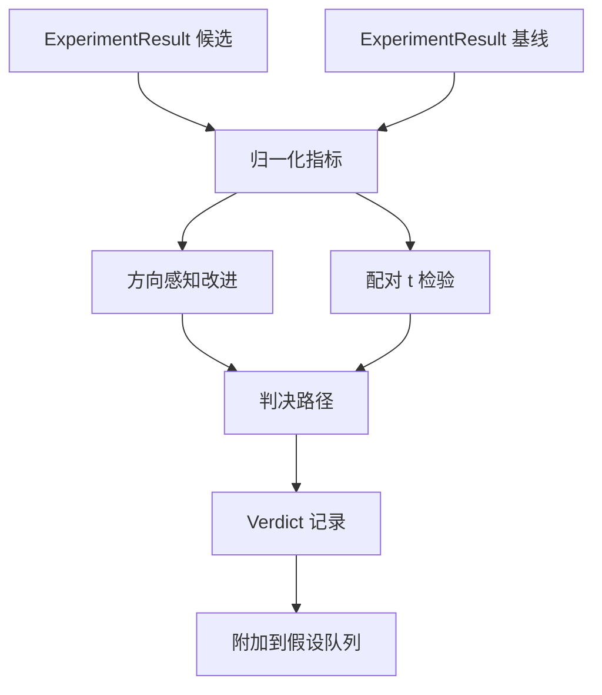

# 结果评估器（Result Evaluator）

> 运行器产生了数字。评估器决定这些数字是改进、退步还是噪声。构建将指标转换为一行结论的判决路径。

**类型：** 构建  
**语言：** Python  
**前置知识：** Phase 19 Track A 第 20-29 课  
**预计时间：** 约 90 分钟

## 学习目标
- 使用方向感知改进和固定阈值将候选运行与基线进行比较。
- 从头对每种子指标运行配对 t 检验并读取结果 p 值。
- 归一化对数缩放指标，使下游报告可以将它们与线性指标混合。
- 发出编排器可以附加到第 50 课队列的每个假设判决。
- 保持每个步骤纯粹，使相同输入始终产生相同判决。

## 核心概念

**配对 t 检验**：相同种子，相同数据，候选运行一次，基线运行一次。每个种子贡献一个差值。差值的均值是效应。差值的标准误差是噪声下限。从零实现，没有 scipy。

**方向感知改进**：某些指标越高越好（准确率、吞吐量）；其他越低越好（损失、困惑度、挂钟时间）。

**对数归一化**：困惑度是损失的指数函数。`scale="log"` 的指标在计算改进前取自然对数。

**判决路径**：
1. 如果任何候选结果 terminal != "ok"：verdict = "failed"
2. 否则如果 |improvement| < improvement_threshold：verdict = "noise"
3. 否则如果 p_value is None 或 p_value > significance：verdict = "noise"
4. 否则如果 improvement > 0：verdict = "improved"
5. 否则：verdict = "regressed"

第 50 课产生假设。第 51 课过滤文献中已解决的内容。第 52 课运行候选和基线配置下的实验。第 53 课读取这些运行并写出判决。编排器将四者拼接在一起，不需要任何超出每个课程定义的数据类的粘合代码。
