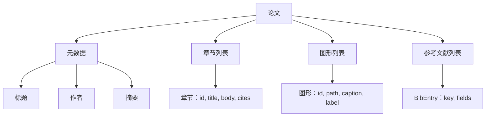

# 论文写作器（Paper Writer）

> LaTeX 骨架是研究人员和排版师之间的契约。如果契约被破坏，文档无法编译，失败是响亮的。先构建骨架，然后填充它。

**类型：** 构建  
**语言：** Python  
**前置知识：** Phase 19 第 50-53 课  
**预计时间：** 约 90 分钟

## 学习目标

- 将研究论文视为具有已知章节图的结构化工件，而非自由格式文档。
- 生成在写任何散文之前声明其摘要、章节、图形槽和参考文献键的 LaTeX 骨架。
- 通过确定性槽机制将实验输出（路径和标题）注入骨架。
- 连接模拟散文生成器，从结构化大纲填充每个章节，使测试框架无需模型即可测试。
- 发出单个 `paper.tex` 加 `references.bib` 加列出每个引用图形和使用的引用的清单。

## 论文形状

**渲染契约**：渲染器保证三个属性。每个图形槽发出带稳定标签 `fig:<id>` 的 `\begin{figure}` 块。每个章节发出带稳定标签 `sec:<id>` 的 `\section{}`。参考文献发出 `\bibliography` 块，其 `references.bib` 只包含声明在论文上的条目，不多不少。

**清单输出**：写作器向输出目录发出三个文件：`paper.tex`、`references.bib`、`manifest.json`。清单是下游评估器或批评循环读取的内容——不解析 LaTeX；读取清单。

**验证门控**：写入任何文件前运行四个门控：每个图形 id 在论文中唯一；每个章节的 `cites` 字段引用了在论文上声明的参考文献键；摘要非空；标题非空。

骨架是核心。章节、图形和引用作为数据声明，散文生成到槽中，清单与 LaTeX 一起发出。每个其他改进都在顶部组合。
