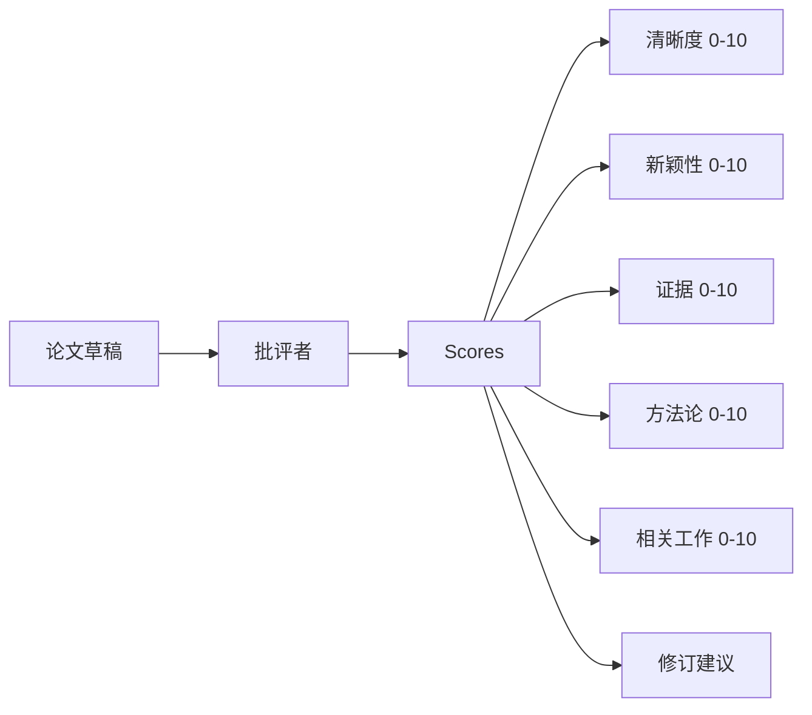

# 批评循环（Critic Loop）

> 第一次就返回"看起来不错"的批评者是坏的。总是返回"需要工作"的批评者也是坏的。有趣的批评者是收敛的那个，你必须工程化收敛。

**类型：** 构建  
**语言：** Python  
**前置知识：** Phase 19 第 50-53 课  
**预计时间：** 约 90 分钟

## 核心概念

**五个固定维度**：给测试框架一个契约。分数是一个向量。测试框架监视每个维度的多个轮次。提高清晰度但破坏证据的修订是证据上的退步，收敛检查会看到它。

**收敛规则**，按顺序：
1. 所有五个维度 >= 目标：收敛（目标）
2. 检测到平台（连续两轮均值改进 < epsilon）：收敛（平台）
3. 轮次 >= 最大值：停止（预算）

**批评形状**：批评包含分数字典、建议列表（每个带维度、目标和编辑指令）、轮次号和总体原因。

**完整循环契约**：测试框架拥有轮次计数器、追踪和收敛检查。批评者拥有分数。修订者拥有差异。三者都不接触其他方的状态。

**追踪输出**：每轮发出一个带轮次号、分数向量、建议数量和收敛判决的追踪事件。完整追踪与最终草稿一起返回。下一课，迭代调度器，读取追踪来决定分支是否值得保留。

追踪优先设计将批评者问题（五轮后分数平坦）与草稿问题分开，两者在追踪中可见。
