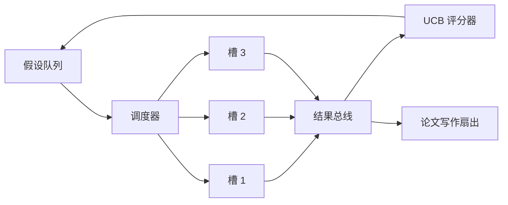

# 迭代调度器（Iteration Scheduler）

> 没有调度器的研究循环是有妄想的工作列表。调度器是循环决定停止探索什么的地方，而这个决定就是整个游戏。

**类型：** 构建  
**语言：** Python  
**前置知识：** Phase 19 第 50-53 课  
**预计时间：** 约 90 分钟

## 核心概念

**UCB 评分**（UCB1）：`ucb(branch) = mean_reward + c * sqrt(ln(total_runs) / runs)`

零运行的分支得到 `+inf`，所以未尝试的分支总是首先被调度。高平均奖励的分支保持高分直到其他分支追上；运行很多次但没有太多奖励的分支会被运行较少的替代方案超越。

**修剪门控**：当分支的平均奖励在至少 `prune_after_runs` 次试验后低于绝对下限时，从未来调度中删除。保持队列有界。

**带 asyncio 的并行槽**：调度器用 `asyncio.create_task` 驱动实验。每个任务运行返回 `Result` 的异步可调用。主循环等待 `asyncio.wait(..., return_when=asyncio.FIRST_COMPLETED)` 并在每次完成时触发评分更新。

**扇出**：当分支的平均奖励超过 `paper_threshold` 时，调度器扇出 `paper.trigger` 事件。当高产结果落地时，调度器可以调用用户提供的 `expander` 产生后续假设。

**两个预算**：`max_experiments`（总实验数）和 `max_seconds`（挂钟上限）。两个中的任一触发时，调度器停止调度新任务，等待飞行中的任务，并返回带 `stop_reason` 的最终追踪。

调度器是研究变得超越工作列表的地方。一旦 UCB 连接且槽并行运行，每个其他改进都在顶部组合。
