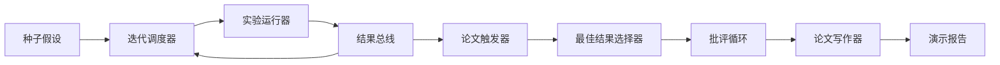

# 端到端研究演示（End-to-End Research Demo）

> 演示是你之前写的每个契约必须组合的地方。如果其中任何一个泄漏，演示就是捕获它的课程。

**类型：** 构建  
**语言：** Python  
**前置知识：** Phase 19 第 50-53 课  
**预计时间：** 约 90 分钟

## 组合的内容

五个阶段。种子是三个假设的列表。调度器用三个并行槽运行六个实验。总线报告一个或多个论文触发器。选择器选择单个最佳结果。批评循环在从该结果构建的草稿上迭代。论文写作器发出最终 LaTeX、BibTeX 和清单。

**确定性保证**：演示通过构造是确定性的——实验运行器是带种子的 numpy，批评循环的修订者以固定顺序走固定维度，论文写作器的散文生成器是模拟的。给定相同种子，演示发出相同报告。测试通过运行演示两次并比较清单来断言这一属性。

**失败模式处理**：每个阶段要么成功要么引发类型化错误。阶段中的任何失败都会以类型化异常短路演示。

**演示报告形状**：`{scheduler_report, best_branch, best_reward, critic_result, paper_manifest, stop_reason}` — 每个字段直接来自上游阶段。演示不转换任何输出；它组合它们。这就是演示的测试。

演示的工作是证明组合就是架构。五节课，四个导入，一个报告。下次你添加阶段时，连接恰好增长一行。
